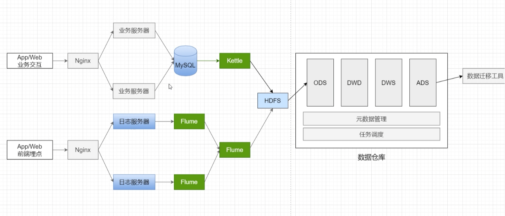
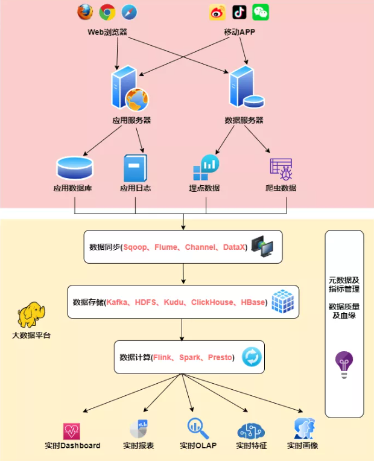
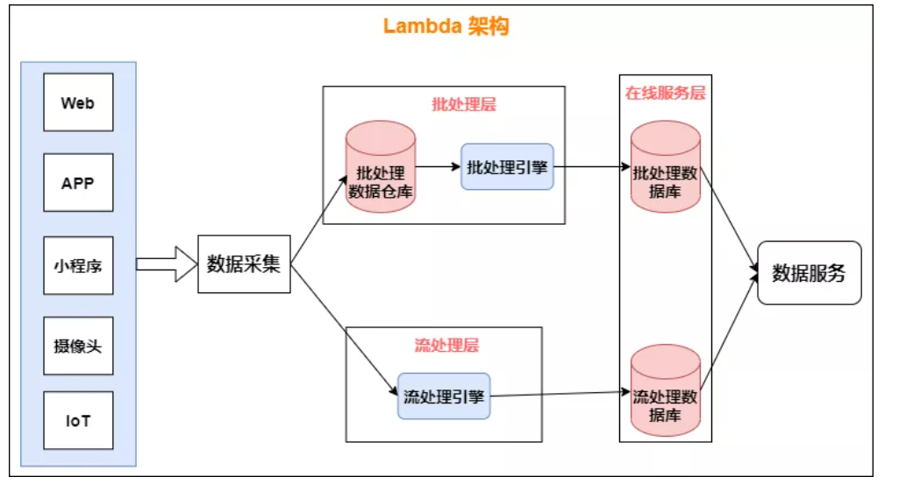
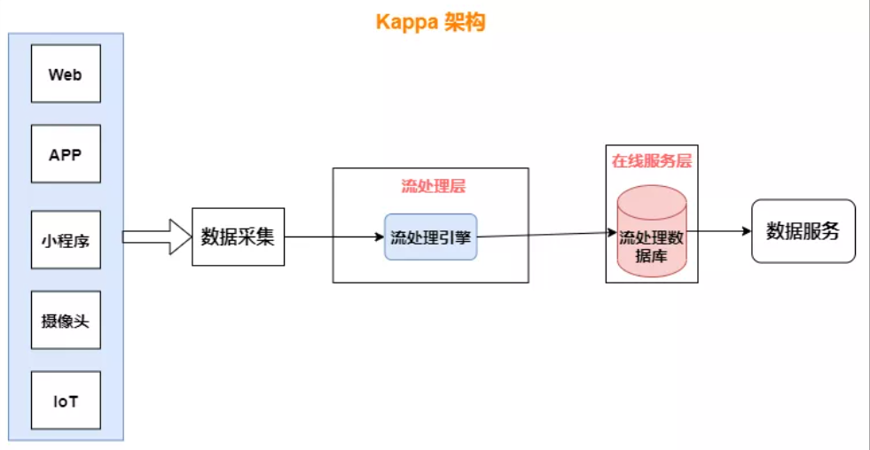
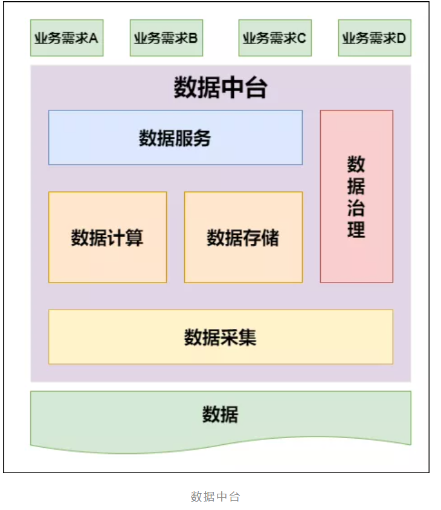

1.数据来源：比如，网站或者app。非常重要的一点，就是埋点。也就是说，埋点，在网站/app的哪个页面的哪些操作发生时，前端的代码（网站，JavaScript；app，android/IOS），就通过网络请求，（Ajax；socket），向后端的服务器发送指定格式的日志数据。

2.Nginx，后台Web服务器（Tomcat、Jetty），后台系统（J2EE、PHP）。到这一步为止，其实还是可以跟我们之前的离线日志收集流程一样。走后面的通过一个日志传输工具，给放入指定的文件夹。
flume，监控指定的文件夹

3.Kafka，我们的日志数据，怎么处理，都是由你自己决定。可以每天收集一份，放到flume，转移到HDFS里面，清洗后放入Hive，建立离线的数据仓库。

也可以每收集1分钟的数据，或者每收集一点数据，就放入文件，然后转移到flume中去，或者直接通过API定制，直接把一条一条的log打入flume。可以配置flume，将数据写入Kafka

4.实时数据，通常都是从分布式消息队列集群中读取的，比如Kafka；实时数据，实时的log，实时的写入到消息队列中，比如Kafka；然后呢，再由我们后端的实时数据处理程序（Storm、Spark Streaming），实时从Kafka中读取数据，log日志。然后进行实时的计算和处理。

5.实时的，主动从Kafka中拉取数据

6.大数据实时计算系统，比如说用Storm、Spark Streaming、Flink开发的，可以实时的从Kafka中拉取数据，然后对实时的数据进行处理和计算，这里可以封装大量复杂的业务逻辑，甚至调用复杂的机器学习、数据挖掘、智能推荐的算法，然后实现实时的车辆调度、实时推荐。

大数据平台的实时架构

- **数据同步：**

在上面这张架构图中，数据从Web平台中产生，通过数据同步系统导入到大数据平台，由于数据源不同，这里的数据同步系统实际上是多个相关系统的组合。数据库同步通常用 Sqoop，日志同步可以选择 Flume等，不同的数据源产生的数据质量可能差别很大，数据库中的格式化数据直接导入大数据系统即可，而日志和爬虫产生的数据就需要进行大量的清洗、转化处理才能有效使用。

- **数据存储：**

该层对原始数据、清洗关联后的明细数据进行存储，基于统一的实时数据模型分层理念，将不同应用场景的数据分别存储在 Kafka、HDFS、Kudu、 Clickhouse、Hbase等存储中。

- **数据计算：**

计算层主要使用 Flink、Spark、Presto 以及 ClickHouse 自带的计算能力等四种计算引擎，Flink 计算引擎主要用于实时数据同步、 流式 ETL、关键系统秒级实时指标计算场景，Spark SQL 主要用于复杂多维分析的准实时指标计算需求场景，Presto 和 ClickHouse 主要满足多维自助分析、对查询响应时间要求不太高的场景。

- **实时应用：**

以统一查询服务对各个业务线数据场景进行支持，业务主要包括实时大屏、实时数据产品、实时 OLAP、实时特征等。

数据从底层的数据源开始，经过Kafka、Flume等数据组件进行收集，然后分成两条线进行计算：

- 一条线是进入流式计算平台（例如 Storm、Flink或者SparkStreaming），去计算实时的一些指标；
- 另一条线进入批量数据处理离线计算平台（例如Mapreduce、Hive，Spark SQL），去计算T+1的相关业务指标，这些指标需要隔日才能看见。

**1. 批处理层存储管理主数据集（不可变的数据集）和预先批处理计算好的视图：**

批处理层使用可处理大量数据的分布式处理系统预先计算结果。它通过处理所有的已有历史数据来实现数据的准确性。这意味着它是基于完整的数据集来重新计算的，能够修复任何错误，然后更新现有的数据视图。输出通常存储在只读数据库中，更新则完全取代现有的预先计算好的视图。

**2. 流处理层会实时处理新来的大数据：**

流处理层通过提供最新数据的实时视图来最小化延迟。流处理层所生成的数据视图可能不如批处理层最终生成的视图那样准确或完整，但它们几乎在收到数据后立即可用。而当同样的数据在批处理层处理完成后，在速度层的数据就可以被替代掉了。

一些缺点：

- **使用两套大数据处理引擎**：维护两个复杂的分布式系统，成本非常高。
- **批量计算在计算窗口内无法完成**：在IOT时代，数据量级越来越大，经常发现夜间只有4、5个小时的时间窗口，已经无法完成白天20多个小时累计的数据，保证早上上班前准时出数据已成为每个大数据团队头疼的问题。
- **数据源变化都要重新开发，开发周期长**：每次数据源的格式变化，业务的逻辑变化都需要针对ETL和Streaming做开发修改，整体开发周期很长，业务反应不够迅速。

**可以认为Kappa架构是Lambda架构的一个简化版本，只是去除掉了Lambda架构中的离线批处理部分**；

**Kappa架构的兴起主要有两个原因**：

- Kafka不仅起到消息队列的作用，也可以保存更长时间的历史数据，以替代Lambda架构中批处理层数据仓库部分。流处理引擎以一个更早的时间作为起点开始消费，起到了批处理的作用。
- Flink流处理引擎解决了事件乱序下计算结果的准确性问题。

Lambda和kappa架构都有各自的适用领域；例如流处理与批处理分析流程比较统一，且允许一定的容错，用Kappa比较合适，少量关键指标（例如交易金额、业绩统计等）使用Lambda架构进行批量计算，增加一次校对过程。

还有一些比较复杂的场景，批处理与流处理产生不同的结果（使用不同的机器学习模型，专家系统，或者实时计算难以处理的复杂计算），可能更适合Lambda架构。

数据中台

在数据开发中，核心数据模型的变化是相对缓慢的，同时，对数据进行维护的工作量也非常大；但业务创新的速度、对数据提出的需求的变化，是非常快速的。

数据中台的出现，就是为了弥补数据开发和应用开发之间，由于开发速度不匹配，出现的响应力跟不上的问题。

数据中台解决的问题可以总结为如下三点：

1. 效率问题：为什么应用开发增加一个报表，就要十几天时间？为什么不能实时获得用户推荐清单？当业务人员对数据产生一点疑问的时候，需要花费很长的时间，结果发现是数据源的数据变了，最终影响上线时间。
2. 协作问题：当业务应用开发的时候，虽然和别的项目需求大致差不多，但因为是别的项目组维护的，所以数据还是要自己再开发一遍。
3. 能力问题：数据的处理和维护是一个相对独立的技术，需要相当专业的人来完成，但是很多时候，我们有一大把的应用开发人员，而数据开发人员很少。

