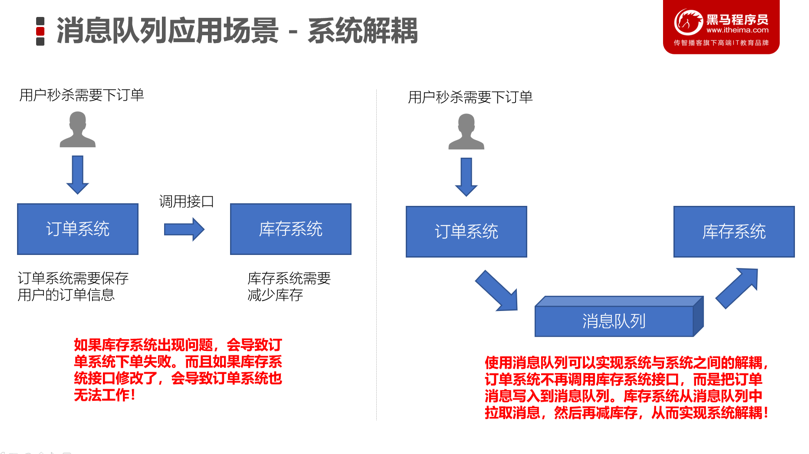
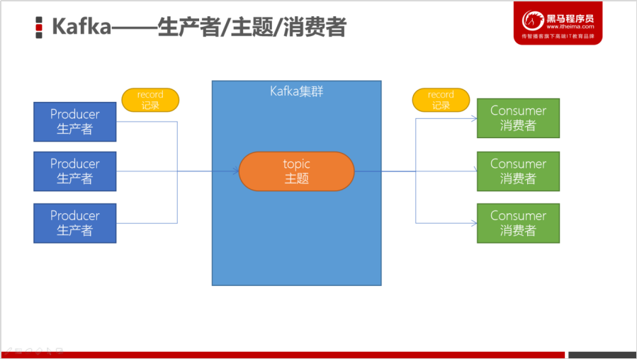
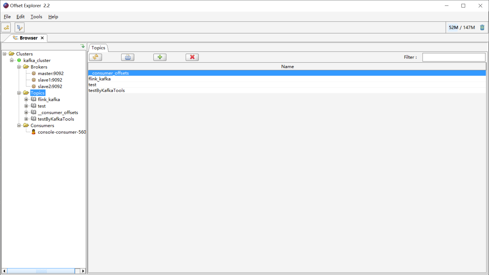
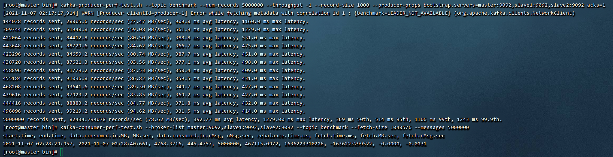
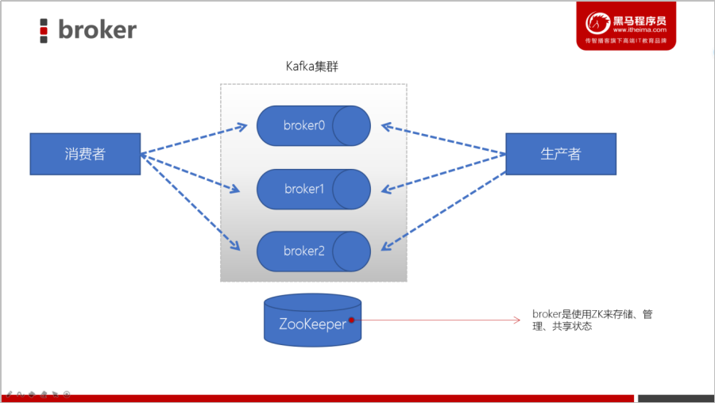
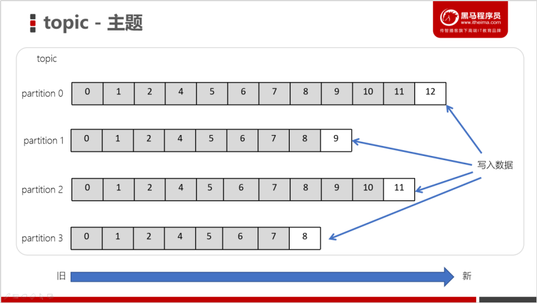
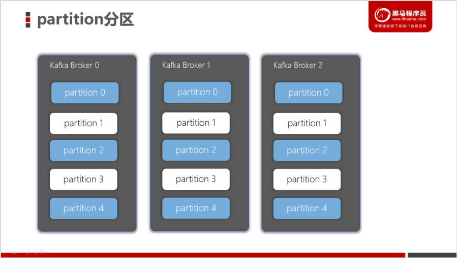
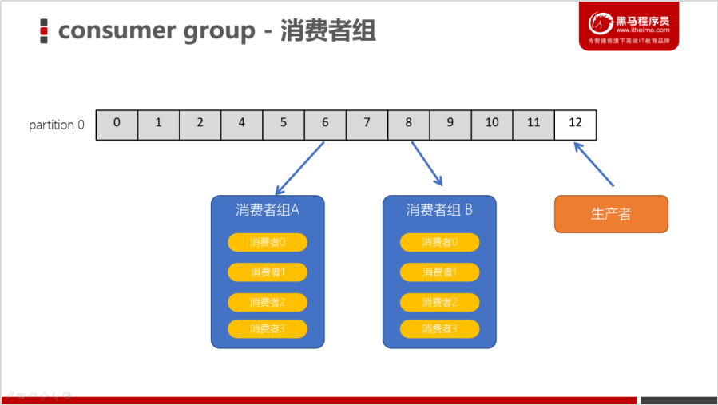
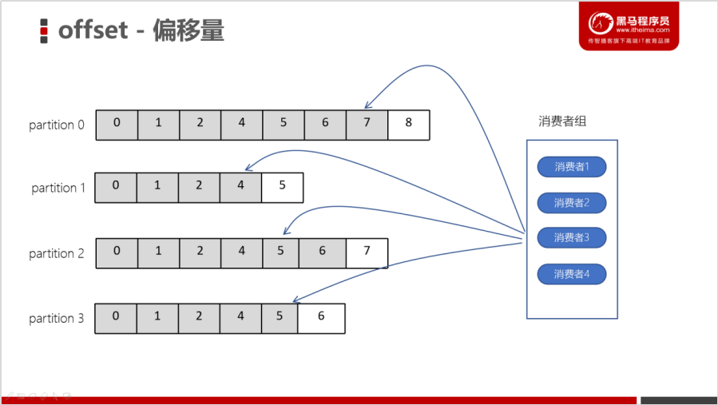
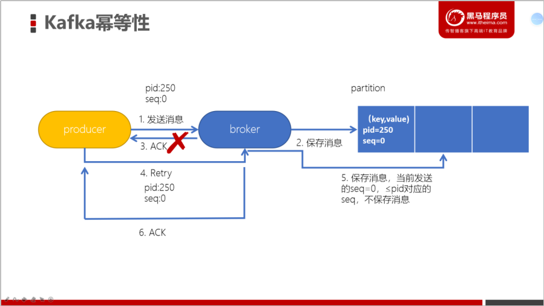

# Kafka

## Kafka简介

### 消息队列(Message Queue)

* 消息队列——用于存放消息的组件
* 程序员可以将消息放入到队列中，也可以从消息队列中获取消息
* 很多时候消息队列不是一个永久性的存储，是作为临时存储存在的（设定一个期限：设置消息在MQ中保存10天）
* 消息队列中间件：消息队列的组件，例如：Kafka、Active MQ、RabbitMQ、RocketMQ、ZeroMQ
* 消息队列低延迟、高可靠、高吞吐的，可以应对大量并发

### Kafka的应用场景

* 异步处理
  * 可以将一些比较耗时的操作放在其他系统中，通过消息队列将需要进行处理的消息进行存储，其他系统可以消费消息队列中的数据
  * 比较常见的：发送短信验证码、发送邮件


* 系统解耦
  * 原先一个微服务是通过接口（HTTP）调用另一个微服务，这时候耦合很严重，只要接口发生变化就会导致系统不可用
  * 使用消息队列可以将系统进行解耦合，现在第一个微服务可以将消息放入到消息队列中，另一个微服务可以从消息队列中把消息取出来进行处理。进行系统解耦



* 流量削峰
  * 因为消息队列是低延迟、高可靠、高吞吐的，可以应对大量并发

* 日志处理
  * 可以使用消息队列作为临时存储，或者一种通信管道


### 消息队列的两种模型

* 生产者、消费者模型
  * 生产者负责将消息生产到MQ中
  * 消费者负责从MQ中获取消息
  * 生产者和消费者是解耦的，可能是生产者一个程序、消费者是另外一个程序
* 消息队列的模式
  * 点对点：一个消费者消费一个消息
  * 发布订阅：多个消费者可以消费一个消息


## Kafka集群搭建

* Kafka集群是必须要有ZooKeeper的

注意：

* 每一个Kafka的节点都需要修改broker.id（每个节点的标识，不能重复）
* log.dir数据存储目录需要配置

```shell
# 1. 上传kafka安装包并解压到/software/
tar -xvzf /data/packs/kafka_2.12-2.4.1.tgz -C /software/
# 	修改路径名
mv /software/kafka_2.12-2.4.1 /software/kafka/

# 2. 修改环境变量
vi /etc/profile

# Kafka
export KAFKA_HOME=/software/kafka
export ONEKEY_HOME=/software/onekey
export PATH=:$PATH:${KAFKA_HOME}:$ONEKEY_HOME

# 3. 修改server.properties
vi /software/kafka/config/server.properties

# 指定broker的id
broker.id=0
# 指定Kafka数据的位置
log.dirs=/software/kafka/data
# 配置zk的三个节点
zookeeper.connect=master:2181,slave1:2181,slave2:2181

# 4. 将安装好的kafka复制到另外两台服务器broker.id分别为1和2
scp -r /software/kafka/ slave1:/software/
scp -r /software/kafka/ slave2:/software/
scp /etc/profile slave1:/etc/
scp /etc/profile slave2:/etc/
. /etc/profile	

# 5. 启动服务器
# 启动zookeeper
zkSever.sh start
# 启动Kafka
cd /export/server/kafka_2.12-2.4.1
nohup bin/kafka-server-start.sh config/server.properties &
# 测试Kafka集群是否启动成功
bin/kafka-topics.sh --bootstrap-server master:9092 --list
  
```

###   目录结构分析

| 目录名称  | 说明                                                         |
| --------- | ------------------------------------------------------------ |
| bin       | Kafka的所有执行脚本都在这里。例如：启动Kafka服务器、创建Topic、生产者、消费者程序等等 |
| config    | Kafka的所有配置文件                                          |
| libs      | 运行Kafka所需要的所有JAR包                                   |
| logs      | Kafka的所有日志文件，如果Kafka出现一些问题，需要到该目录中去查看异常信息 |
| site-docs | Kafka的网站帮助文件                                          |

### Kafka一键启动、关闭shell

```shell
# 1.在节点1中创建 /software/onekey 目录
cd /software/onekey

2.准备slave配置文件，用于保存要启动哪几个节点上的kafka
master
slave1
slave2

3.编写start-kafka.sh脚本
vi start-kafka.sh

cat /software/onekey/slave | while read line
do
{
 echo $line
 ssh $line "source /etc/profile;export JMX_PORT=9988;nohup ${KAFKA_HOME}/bin/kafka-server-start.sh ${KAFKA_HOME}/config/server.properties >/dev/nul* 2>&1 & "
}&
wait
done

4.编写stop-kafka.sh脚本
vi stop-kafka.sh

cat /software/onekey/slave | while read line
do
{
 echo $line
 ssh $line "source /etc/profile;jps |grep Kafka |cut -d' ' -f1 |xargs kill -s 9"
}&
wait
done

5.给start-kafka.sh、stop-kafka.sh配置执行权限
chmod u+x start-kafka.sh
chmod u+x stop-kafka.sh

6.执行一键启动、一键关闭
./start-kafka.sh
./stop-kafka.sh
```

## 基础操作



### 创建topic

创建一个topic（主题）。Kafka中所有的消息都是保存在主题中，要生产消息到Kafka，首先必须要有一个确定的主题。

```shell
# 创建名为test的主题
kafka-topics.sh --create --bootstrap-server master:9092 --topic test
# 查看目前Kafka中的主题
kafka-topics.sh --list --bootstrap-server master:9092
```


 

### 生产消息到Kafka

使用Kafka内置的测试程序，生产一些消息到Kafka的test主题中。

```shell
kafka-console-producer.sh --broker-list master:9092 --topic test
```


### 从Kafka消费消息

使用下面的命令来消费 test 主题中的消息。

```shell
kafka-console-consumer.sh --bootstrap-server master:9092 --topic test --from-beginning
```


### 使用Kafka Tools操作Kafka

安装Kafka Tools后启动Kafka




### Kafka的生产者/消费者/工具

* 安装Kafka集群，可以测试以下
  * 创建一个topic主题（消息都是存放在topic中，类似mysql建表的过程）
  * 基于kafka的内置测试生产者脚本来读取标准输入（键盘输入）的数据，并放入到topic中
  * 基于kafka的内置测试消费者脚本来消费topic中的数据
* 推荐大家开发的使用Kafka Tool
  * 浏览Kafka集群节点、多少个topic、多少个分区
  * 创建topic/删除topic
  * 浏览ZooKeeper中的数据

## Kafka的基准测试

### 基于1个分区1个副本的基准测试

测试步骤：

1. 启动Kafka集群

2. 创建一个1个分区1个副本的topic: benchmark

3. 同时运行生产者、消费者基准测试程序

4. 观察结果

```shell
# 1.创建topic
kafka-topics.sh --zookeeper master:2181 --create --topic benchmark --partitions 1 --replication-factor 1

# 2. 生产消息基准测试
kafka-producer-perf-test.sh --topic benchmark --num-records 5000000 --throughput -1 --record-size 1000 --producer-props bootstrap.servers=master:9092,slave1:9092,slave2:9092 acks=1

# kafka-producer-perf-test.sh 
# --topic topic的名字
# --num-records	总共指定生产数据量（默认5000W）
# --throughput	指定吞吐量——限流（-1不指定）
# --record-size   record数据大小（字节）
# --producer-props bootstrap.servers=master:9092,slave1:9092,slave2:9092 acks=1 指定Kafka集群地址，ACK模式

# 3. 消费信息
kafka-consumer-perf-test.sh --broker-list master:9092,slave1:9092,slave2:9092 --topic benchmark --fetch-size 1048576 --messages 5000000

# kafka-consumer-perf-test.sh
# --broker-list 指定kafka集群地址
# --topic 指定topic的名称
# --fetch-size 每次拉取的数据大小
# --messages 总共要消费的消息个数
```



在虚拟机上，因为都是共享笔记本上的CPU、内存、网络，所以分区越多，反而效率越低。但如果是真实的服务器，分区多效率是会有明显提升的。

同样的配置，副本越多速度越慢


Kafka中提供了内置的性能测试工具

* 生产者：测试生产每秒传输的数据量（多少条数据、多少M的数据）

  ```html
  5000000 records sent, 11825.446943 records/sec (11.28 MB/sec), 2757.61 ms avg latency
  ```

* 消费者：测试消费每条拉取的数据量

* 对比生产者和消费者：消费者的速度更快


## 架构

### 1. broker



* Kafka服务器进程，生产者、消费者都要连接broker
* 一个集群由多个broker组成，功能实现Kafka集群的负载均衡、容错
* l broker是***\*无状态（Sateless）\****的，它们是通过ZooKeeper来维护集群状态

### 2. zookeeper

管理和协调broker，并且存储了Kafka的元数据,主要用于通知生产者和消费者Kafka集群中有新的broker加入、或者Kafka集群中出现故障的broker

### 3. producer：生产者

l生产者负责将数据推送给broker的topic

### 4. consumer：消费者

消费者负责从broker的topic中拉取数据，并自己进行处理

### 5. topic：主题

一个Kafka集群中，可以包含多个topic。一个topic可以包含多个分区

* 是一个逻辑结构，生产、消费消息都需要指定topic
* 主题是一个逻辑概念，用于生产者发布数据，消费者拉取数据
* Kafka中的主题必须要有标识符，而且是唯一的，Kafka中可以有任意数量的主题，没有数量上的限制
* 在主题中的消息是有结构的，一般一个主题包含某一类消息
* 一旦生产者发送消息到主题中，这些消息就不能被更新（更改）
* 

### 6. partition：分区

Kafka集群的分布式就是由分区来实现的。一个topic中的消息可以分布在topic中的不同partition中



### 7. replica：副本

实现Kafkaf集群的容错，实现partition的容错。一个topic至少应该包含大于1个的副本


### 8. consumer group：消费者组

一个消费者组中的消费者可以共同消费topic中的分区数据。每一个消费者组都有一个唯一的名字。配置group.id一样的消费者是属于同一个组中



### 9. offset：偏移量

相对消费者、partition来说，可以通过offset来拉取数据



### 消费者组

* 一个消费者组中可以包含多个消费者，共同来消费topic中的数据
* 一个topic中如果只有一个分区，那么这个分区只能被某个组中的一个消费者消费
* 有多少个分区，那么就可以被同一个组内的多少个消费者消费

### 幂等性

* 生产者消息重复问题

  * Kafka生产者生产消息到partition，如果直接发送消息，kafka会将消息保存到分区中，但Kafka会返回一个ack给生产者，表示当前操作是否成功，是否已经保存了这条消息。如果ack响应的过程失败了，此时生产者会重试，继续发送没有发送成功的消息，Kafka又会保存一条一模一样的消息

    

* 在Kafka中可以开启幂等性

  * 当Kafka的生产者生产消息时，会增加一个pid（生产者的唯一编号）和sequence number（针对消息的一个递增序列）
  * 发送消息，会连着pid和sequence number一块发送
  * kafka接收到消息，会将消息和pid、sequence number一并保存下来
  * 如果ack响应失败，生产者重试，再次发送消息时，Kafka会根据pid、sequence number是否需要再保存一条消息
  * 判断条件：生产者发送过来的sequence number 是否小于等于 partition中消息对应的sequence

