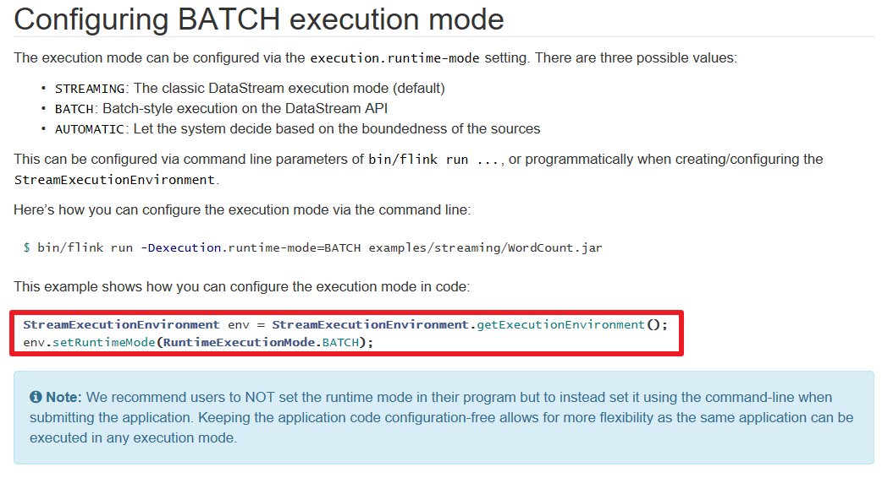

#  Flink入门案例

## 前置说明


注意:入门案例使用DataSet后续就不再使用了,而是使用流批一体的DataStream


https://ci.apache.org/projects/flink/flink-docs-release-1.12/dev/batch/


## 准备环境

新建一个maven工程，在pom.xml中添加依赖项

```xml
<?xml version="1.0" encoding="UTF-8"?>
<project xmlns="http://maven.apache.org/POM/4.0.0"
         xmlns:xsi="http://www.w3.org/2001/XMLSchema-instance"
         xsi:schemaLocation="http://maven.apache.org/POM/4.0.0 http://maven.apache.org/xsd/maven-4.0.0.xsd">
    <modelVersion>4.0.0</modelVersion>

    <groupId>cn.itcast</groupId>
    <artifactId>Flink_test</artifactId>
    <version>1.0-SNAPSHOT</version>
    <!-- 指定仓库位置，依次为aliyun、apache和cloudera仓库 -->
    <repositories>
        <repository>
            <id>aliyun</id>
            <url>http://maven.aliyun.com/nexus/content/groups/public/</url>
        </repository>
        <repository>
            <id>apache</id>
            <url>https://repository.apache.org/content/repositories/snapshots/</url>
        </repository>
        <repository>
            <id>cloudera</id>
            <url>https://repository.cloudera.com/artifactory/cloudera-repos/</url>
        </repository>
    </repositories>

    <properties>
        <encoding>UTF-8</encoding>
        <project.build.sourceEncoding>UTF-8</project.build.sourceEncoding>
        <maven.compiler.source>1.8</maven.compiler.source>
        <maven.compiler.target>1.8</maven.compiler.target>
        <java.version>1.8</java.version>
        <scala.version>2.12</scala.version>
        <flink.version>1.14.0</flink.version>
    </properties>
    <dependencies>
        <dependency>
            <groupId>org.apache.flink</groupId>
            <artifactId>flink-clients_2.12</artifactId>
            <version>${flink.version}</version>
        </dependency>
        <dependency>
            <groupId>org.apache.flink</groupId>
            <artifactId>flink-scala_2.12</artifactId>
            <version>${flink.version}</version>
        </dependency>
        <dependency>
            <groupId>org.apache.flink</groupId>
            <artifactId>flink-java</artifactId>
            <version>${flink.version}</version>
        </dependency>
        <dependency>
            <groupId>org.apache.flink</groupId>
            <artifactId>flink-streaming-scala_2.12</artifactId>
            <version>${flink.version}</version>
        </dependency>
        <dependency>
            <groupId>org.apache.flink</groupId>
            <artifactId>flink-streaming-java_2.12</artifactId>
            <version>${flink.version}</version>
        </dependency>
        <dependency>
            <groupId>org.apache.flink</groupId>
            <artifactId>flink-table-api-scala-bridge_2.12</artifactId>
            <version>${flink.version}</version>
        </dependency>
        <dependency>
            <groupId>org.apache.flink</groupId>
            <artifactId>flink-table-api-java-bridge_2.12</artifactId>
            <version>${flink.version}</version>
        </dependency>
        <!-- flink执行计划,这是1.9版本之前的-->
        <dependency>
            <groupId>org.apache.flink</groupId>
            <artifactId>flink-table-planner_2.12</artifactId>
            <version>${flink.version}</version>
        </dependency>
        <!-- blink执行计划,1.11+默认的-->

        <dependency>
            <groupId>org.apache.flink</groupId>
            <artifactId>flink-table-common</artifactId>
            <version>${flink.version}</version>
        </dependency>

        <!--<dependency>
            <groupId>org.apache.flink</groupId>
            <artifactId>flink-cep_2.12</artifactId>
            <version>${flink.version}</version>
        </dependency>-->

        <!-- flink连接器-->
        <dependency>
            <groupId>org.apache.flink</groupId>
            <artifactId>flink-connector-kafka_2.12</artifactId>
            <version>${flink.version}</version>
        </dependency>
        <dependency>
            <groupId>org.apache.flink</groupId>
            <artifactId>flink-sql-connector-kafka_2.12</artifactId>
            <version>${flink.version}</version>
        </dependency>
        <dependency>
            <groupId>org.apache.flink</groupId>
            <artifactId>flink-connector-jdbc_2.12</artifactId>
            <version>${flink.version}</version>
        </dependency>
        <dependency>
            <groupId>org.apache.flink</groupId>
            <artifactId>flink-csv</artifactId>
            <version>${flink.version}</version>
        </dependency>
        <dependency>
            <groupId>org.apache.flink</groupId>
            <artifactId>flink-json</artifactId>
            <version>${flink.version}</version>
        </dependency>

        <!-- <dependency>
           <groupId>org.apache.flink</groupId>
           <artifactId>flink-connector-filesystem_2.12</artifactId>
           <version>${flink.version}</version>
       </dependency>-->
        <!--<dependency>
            <groupId>org.apache.flink</groupId>
            <artifactId>flink-jdbc_2.12</artifactId>
            <version>${flink.version}</version>
        </dependency>-->
        <!--<dependency>
              <groupId>org.apache.flink</groupId>
              <artifactId>flink-parquet_2.12</artifactId>
              <version>${flink.version}</version>
         </dependency>-->
        <!--<dependency>
            <groupId>org.apache.avro</groupId>
            <artifactId>avro</artifactId>
            <version>1.9.2</version>
        </dependency>
        <dependency>
            <groupId>org.apache.parquet</groupId>
            <artifactId>parquet-avro</artifactId>
            <version>1.10.0</version>
        </dependency>-->


        <dependency>
            <groupId>org.apache.bahir</groupId>
            <artifactId>flink-connector-redis_2.11</artifactId>
            <version>1.0</version>
            <exclusions>
                <exclusion>
                    <artifactId>flink-streaming-java_2.11</artifactId>
                    <groupId>org.apache.flink</groupId>
                </exclusion>
                <exclusion>
                    <artifactId>flink-runtime_2.11</artifactId>
                    <groupId>org.apache.flink</groupId>
                </exclusion>
                <exclusion>
                    <artifactId>flink-core</artifactId>
                    <groupId>org.apache.flink</groupId>
                </exclusion>
                <exclusion>
                    <artifactId>flink-java</artifactId>
                    <groupId>org.apache.flink</groupId>
                </exclusion>
            </exclusions>
        </dependency>

        <dependency>
            <groupId>org.apache.flink</groupId>
            <artifactId>flink-connector-hive_2.12</artifactId>
            <version>${flink.version}</version>
        </dependency>
        <dependency>
            <groupId>org.apache.hive</groupId>
            <artifactId>hive-metastore</artifactId>
            <version>2.1.0</version>
        </dependency>
        <dependency>
            <groupId>org.apache.hive</groupId>
            <artifactId>hive-exec</artifactId>
            <version>2.1.0</version>
        </dependency>

        <dependency>
            <groupId>org.apache.flink</groupId>
            <artifactId>flink-shaded-hadoop-2-uber</artifactId>
            <version>2.7.5-10.0</version>
        </dependency>

        <dependency>
            <groupId>org.apache.hbase</groupId>
            <artifactId>hbase-client</artifactId>
            <version>2.1.0</version>
        </dependency>

        <dependency>
            <groupId>mysql</groupId>
            <artifactId>mysql-connector-java</artifactId>
            <version>5.1.38</version>
            <!--<version>8.0.20</version>-->
        </dependency>

        <!-- 高性能异步组件：Vertx-->
        <dependency>
            <groupId>io.vertx</groupId>
            <artifactId>vertx-core</artifactId>
            <version>3.9.0</version>
        </dependency>
        <dependency>
            <groupId>io.vertx</groupId>
            <artifactId>vertx-jdbc-client</artifactId>
            <version>3.9.0</version>
        </dependency>
        <dependency>
            <groupId>io.vertx</groupId>
            <artifactId>vertx-redis-client</artifactId>
            <version>3.9.0</version>
        </dependency>

        <!-- 日志 -->
        <dependency>
            <groupId>org.slf4j</groupId>
            <artifactId>slf4j-log4j12</artifactId>
            <version>1.7.7</version>
            <scope>runtime</scope>
        </dependency>
        <dependency>
            <groupId>log4j</groupId>
            <artifactId>log4j</artifactId>
            <version>1.2.17</version>
            <scope>runtime</scope>
        </dependency>

        <dependency>
            <groupId>com.alibaba</groupId>
            <artifactId>fastjson</artifactId>
            <version>1.2.44</version>
        </dependency>

        <dependency>
            <groupId>org.projectlombok</groupId>
            <artifactId>lombok</artifactId>
            <version>1.18.2</version>
            <scope>provided</scope>
        </dependency>

        <!-- 参考：https://blog.csdn.net/f641385712/article/details/84109098-->
        <!--<dependency>
            <groupId>org.apache.commons</groupId>
            <artifactId>commons-collections4</artifactId>
            <version>4.4</version>
        </dependency>-->
        <!--<dependency>
            <groupId>org.apache.thrift</groupId>
            <artifactId>libfb303</artifactId>
            <version>0.9.3</version>
            <type>pom</type>
            <scope>provided</scope>
         </dependency>-->
        <!--<dependency>
           <groupId>com.google.guava</groupId>
           <artifactId>guava</artifactId>
           <version>28.2-jre</version>
       </dependency>-->

    </dependencies>

    <build>
        <sourceDirectory>src/main/java</sourceDirectory>
        <plugins>
            <!-- 编译插件 -->
            <plugin>
                <groupId>org.apache.maven.plugins</groupId>
                <artifactId>maven-compiler-plugin</artifactId>
                <version>3.5.1</version>
                <configuration>
                    <source>1.8</source>
                    <target>1.8</target>
                    <!--<encoding>${project.build.sourceEncoding}</encoding>-->
                </configuration>
            </plugin>
            <plugin>
                <groupId>org.apache.maven.plugins</groupId>
                <artifactId>maven-surefire-plugin</artifactId>
                <version>2.18.1</version>
                <configuration>
                    <useFile>false</useFile>
                    <disableXmlReport>true</disableXmlReport>
                    <includes>
                        <include>**/*Test.*</include>
                        <include>**/*Suite.*</include>
                    </includes>
                </configuration>
            </plugin>
            <!-- 打包插件(会包含所有依赖) -->
            <plugin>
                <groupId>org.apache.maven.plugins</groupId>
                <artifactId>maven-shade-plugin</artifactId>
                <version>2.3</version>
                <executions>
                    <execution>
                        <phase>package</phase>
                        <goals>
                            <goal>shade</goal>
                        </goals>
                        <configuration>
                            <filters>
                                <filter>
                                    <artifact>*:*</artifact>
                                    <excludes>
                                        <!--
                                        zip -d learn_spark.jar META-INF/*.RSA META-INF/*.DSA META-INF/*.SF -->
                                        <exclude>META-INF/*.SF</exclude>
                                        <exclude>META-INF/*.DSA</exclude>
                                        <exclude>META-INF/*.RSA</exclude>
                                    </excludes>
                                </filter>
                            </filters>
                            <transformers>
                                <transformer implementation="org.apache.maven.plugins.shade.resource.ManifestResourceTransformer">
                                    <!-- 设置jar包的入口类(可选) -->
                                    <mainClass></mainClass>
                                </transformer>
                            </transformers>
                        </configuration>
                    </execution>
                </executions>
            </plugin>
        </plugins>
    </build>
</project>

```

## 代码实现

### DataSet


```java
package cn.itcast.hello;

import groovy.lang.Tuple;
import org.apache.flink.api.common.functions.FlatMapFunction;
import org.apache.flink.api.common.functions.MapFunction;
import org.apache.flink.api.java.DataSet;
import org.apache.flink.api.java.ExecutionEnvironment;
import org.apache.flink.api.java.operators.*;
import org.apache.flink.api.java.tuple.Tuple2;
import org.apache.flink.util.Collector;
import org.stringtemplate.v4.ST;

public class WordCount_DataSet {
    public static void main(String[] args) throws Exception {
        // TODO 0. 准备环境 env
        ExecutionEnvironment env = ExecutionEnvironment.getExecutionEnvironment();
        // TODO 1. 准备数据 source
        DataSet<String> lines = env.fromElements("it hadoop spark","it hadoop flink","hadoop","spark");
        // TODO 2. 转换 transformation
        //  切割
         /*
        @FunctionalInterface
        public interface FlatMapFunction<T, O> extends Function, Serializable {
            void flatMap(T value, Collector<O> out) throws Exception;
        }
         */
        DataSet<String> words = lines.flatMap(new FlatMapFunction<String, String>() {
            @Override
            public void flatMap(String value, Collector<String> out) throws Exception {
                // value 表示每一行数据
                String[] arr = value.split(" ");
                for (String word : arr) {
                    out.collect(word);
                }
            }
        });

        //  数据量设为1
         /*
        @FunctionalInterface
        public interface MapFunction<T, O> extends Function, Serializable {
            O map(T value) throws Exception;
        }
         */
        DataSet<Tuple2<String, Integer>> wordAddOne = words.map(new MapFunction<String, Tuple2<String, Integer>>() {
            @Override
            public Tuple2<String, Integer> map(String value) throws Exception {
                return Tuple2.of(value, 1);
            }
        });

        //  分组
        UnsortedGrouping<Tuple2<String, Integer>> grouped = wordAddOne.groupBy(0);

        //  聚合
        AggregateOperator<Tuple2<String, Integer>> result = grouped.sum(1);

        // TODO 3. 打印sink
        result.print();

    }
}
```


### 代码实现-DataStream-匿名内部类-处理批



```java
package cn.itcast.hello;

import org.apache.flink.api.common.RuntimeExecutionMode;
import org.apache.flink.api.common.functions.FlatMapFunction;
import org.apache.flink.api.common.functions.MapFunction;
import org.apache.flink.api.java.DataSet;
import org.apache.flink.api.java.ExecutionEnvironment;
import org.apache.flink.api.java.operators.AggregateOperator;
import org.apache.flink.api.java.operators.UnsortedGrouping;
import org.apache.flink.api.java.tuple.Tuple2;
import org.apache.flink.streaming.api.datastream.DataStream;
import org.apache.flink.streaming.api.datastream.KeyedStream;
import org.apache.flink.streaming.api.datastream.SingleOutputStreamOperator;
import org.apache.flink.streaming.api.environment.StreamExecutionEnvironment;
import org.apache.flink.util.Collector;

/**
 * Author itcast
 * Desc 演示Flink-DataStream-API-实现WordCount
 * 注意:在Flink1.14中DataStream既支持流处理也支持批处理,如何区分?
 */

public class WordCount_DataStream {
    public static void main(String[] args) throws Exception {
        // TODO 0. 准备环境 env
        // ExecutionEnvironment env = ExecutionEnvironment.getExecutionEnvironment();
        StreamExecutionEnvironment env = StreamExecutionEnvironment.getExecutionEnvironment();
        env.setRuntimeMode(RuntimeExecutionMode.BATCH);//注意:使用DataStream实现批处理
        // env.setRuntimeMode(RuntimeExecutionMode.STREAMING);//注意:使用DataStream实现流处理
        // env.setRuntimeMode(RuntimeExecutionMode.AUTOMATIC);//注意:使用DataStream根据数据源自动选择使用流还是批

        // TODO 1. 准备数据 source
        // DataSet<String> lines = env.fromElements("it hadoop spark","it hadoop flink","hadoop","spark");
        DataStream<String> lines = env.fromElements("it hadoop spark","it hadoop flink","hadoop","spark");

        // TODO 2. 转换 transformation
        //  切割
         /*
        @FunctionalInterface
        public interface FlatMapFunction<T, O> extends Function, Serializable {
            void flatMap(T value, Collector<O> out) throws Exception;
        }
         */
        DataStream<String> words = lines.flatMap(new FlatMapFunction<String, String>() {
            @Override
            public void flatMap(String value, Collector<String> out) throws Exception {
                // value 表示每一行数据
                String[] arr = value.split(" ");
                for (String word : arr) {
                    out.collect(word);
                }
            }
        });

        //  数据量设为1
         /*
        @FunctionalInterface
        public interface MapFunction<T, O> extends Function, Serializable {
            O map(T value) throws Exception;
        }
         */
        DataStream<Tuple2<String, Integer>> wordAddOne = words.map(new MapFunction<String, Tuple2<String, Integer>>() {
            @Override
            public Tuple2<String, Integer> map(String value) throws Exception {
                //value就是一个个单词
                return Tuple2.of(value, 1);
            }
        });

        //  分组:注意DataSet中分组是groupBy,DataStream分组是keyBy
        //wordAndOne.keyBy(0);
        /*
        @FunctionalInterface
        public interface KeySelector<IN, KEY> extends Function, Serializable {
            KEY getKey(IN value) throws Exception;
        }
         */
        // UnsortedGrouping<Tuple2<String, Integer>> grouped = wordAddOne.groupBy(0);
        KeyedStream<Tuple2<String, Integer>,String> grouped = wordAddOne.keyBy(t -> t.f0); //元组里的第一个

        //  聚合
        // AggregateOperator<Tuple2<String, Integer>> result = grouped.sum(1);
        SingleOutputStreamOperator<Tuple2<String, Integer>> result = grouped.sum(1);

        // TODO 3. 打印sink
        result.print();
        
        //TODO 4.execute/启动并等待程序结束
        env.execute();
    }
}

```


### 代码实现-DataStream-匿名内部类-处理流

```java
package cn.itcast.hello;

import org.apache.flink.api.common.functions.FlatMapFunction;
import org.apache.flink.api.common.functions.MapFunction;
import org.apache.flink.api.java.tuple.Tuple2;
import org.apache.flink.streaming.api.datastream.DataStream;
import org.apache.flink.streaming.api.datastream.KeyedStream;
import org.apache.flink.streaming.api.datastream.SingleOutputStreamOperator;
import org.apache.flink.streaming.api.environment.StreamExecutionEnvironment;
import org.apache.flink.util.Collector;

/**
 * Author itcast
 * Desc 演示Flink-DataStream-API-实现WordCount
 * 注意:在Flink1.14中DataStream既支持流处理也支持批处理,如何区分?
 */

public class WordCount_DataStream {
    public static void main(String[] args) throws Exception {
        // TODO 0. 准备环境 env
        // ExecutionEnvironment env = ExecutionEnvironment.getExecutionEnvironment();
        StreamExecutionEnvironment env = StreamExecutionEnvironment.getExecutionEnvironment();
        // env.setRuntimeMode(RuntimeExecutionMode.BATCH);//注意:使用DataStream实现批处理
        // env.setRuntimeMode(RuntimeExecutionMode.STREAMING);//注意:使用DataStream实现流处理
        // env.setRuntimeMode(RuntimeExecutionMode.AUTOMATIC);//注意:使用DataStream根据数据源自动选择使用流还是批

        // TODO 1. 准备数据 source
        // DataSet<String> lines = env.fromElements("it hadoop spark","it hadoop flink","hadoop","spark");
        // DataStream<String> lines = env.fromElements("it hadoop spark","it hadoop flink","hadoop","spark");
        DataStream<String> lines = env.socketTextStream("master", 9999);

        // TODO 2. 转换 transformation
        //  切割
         /*
        @FunctionalInterface
        public interface FlatMapFunction<T, O> extends Function, Serializable {
            void flatMap(T value, Collector<O> out) throws Exception;
        }
         */
        DataStream<String> words = lines.flatMap(new FlatMapFunction<String, String>() {
            @Override
            public void flatMap(String value, Collector<String> out) throws Exception {
                // value 表示每一行数据
                String[] arr = value.split(" ");
                for (String word : arr) {
                    out.collect(word);
                }
            }
        });

        //  数据量设为1
         /*
        @FunctionalInterface
        public interface MapFunction<T, O> extends Function, Serializable {
            O map(T value) throws Exception;
        }
         */
        DataStream<Tuple2<String, Integer>> wordAddOne = words.map(new MapFunction<String, Tuple2<String, Integer>>() {
            @Override
            public Tuple2<String, Integer> map(String value) throws Exception {
                //value就是一个个单词
                return Tuple2.of(value, 1);
            }
        });

        //  分组:注意DataSet中分组是groupBy,DataStream分组是keyBy
        //wordAndOne.keyBy(0);
        /*
        @FunctionalInterface
        public interface KeySelector<IN, KEY> extends Function, Serializable {
            KEY getKey(IN value) throws Exception;
        }
         */
        // UnsortedGrouping<Tuple2<String, Integer>> grouped = wordAddOne.groupBy(0);
        KeyedStream<Tuple2<String, Integer>,String> grouped = wordAddOne.keyBy(t -> t.f0); //元组里的第一个

        //  聚合
        // AggregateOperator<Tuple2<String, Integer>> result = grouped.sum(1);
        SingleOutputStreamOperator<Tuple2<String, Integer>> result = grouped.sum(1);

        // TODO 3. 打印sink
        result.print();

        //TODO 4.execute/启动并等待程序结束
        env.execute();
    }
}

```

```shell
yum install -y nc
# 安装nc
nc -lk 9999
# 发送数据
```


### 代码实现-DataStream-Lambda

```java
package cn.itcast.hello;

import org.apache.flink.api.common.RuntimeExecutionMode;
import org.apache.flink.api.common.functions.FlatMapFunction;
import org.apache.flink.api.common.functions.MapFunction;
import org.apache.flink.api.common.typeinfo.Types;
import org.apache.flink.api.java.tuple.Tuple2;
import org.apache.flink.streaming.api.datastream.DataStream;
import org.apache.flink.streaming.api.datastream.KeyedStream;
import org.apache.flink.streaming.api.datastream.SingleOutputStreamOperator;
import org.apache.flink.streaming.api.environment.StreamExecutionEnvironment;
import org.apache.flink.util.Collector;


import java.util.Arrays;

/**
 * Author itcast
 * Desc 演示Flink-DataStream-API-实现WordCount
 * 注意:在Flink1.14中DataStream既支持流处理也支持批处理,如何区分?
 */

public class WordCount_DataStream3 {
    public static void main(String[] args) throws Exception {
        // TODO 0. 准备环境 env
        // ExecutionEnvironment env = ExecutionEnvironment.getExecutionEnvironment();
        StreamExecutionEnvironment env = StreamExecutionEnvironment.getExecutionEnvironment();
        // env.setRuntimeMode(RuntimeExecutionMode.BATCH);//注意:使用DataStream实现批处理
        // env.setRuntimeMode(RuntimeExecutionMode.STREAMING);//注意:使用DataStream实现流处理
        env.setRuntimeMode(RuntimeExecutionMode.AUTOMATIC);//注意:使用DataStream根据数据源自动选择使用流还是批

        // TODO 1. 准备数据 source
        // DataSet<String> lines = env.fromElements("it hadoop spark","it hadoop flink","hadoop","spark");
         DataStream<String> lines = env.fromElements("it hadoop spark","it hadoop flink","hadoop","spark");

        // TODO 2. 转换 transformation
        //  切割
         /*
        @FunctionalInterface
        public interface FlatMapFunction<T, O> extends Function, Serializable {
            void flatMap(T value, Collector<O> out) throws Exception;
        }
         */
//        DataStream<String> words = lines.flatMap(new FlatMapFunction<String, String>() {
//            @Override
//            public void flatMap(String value, Collector<String> out) throws Exception {
//                // value 表示每一行数据
//                String[] arr = value.split(" ");
//                for (String word : arr) {
//                    out.collect(word);
//                }
//            }
//        });
        SingleOutputStreamOperator<String> words = lines.flatMap(
                (String value, Collector<String> out) -> Arrays.stream(value.split(" ")).forEach(out::collect)
        ).returns(Types.STRING);


        //  数据量设为1
         /*
        @FunctionalInterface
        public interface MapFunction<T, O> extends Function, Serializable {
            O map(T value) throws Exception;
        }
         */
//        DataStream<Tuple2<String, Integer>> wordAddOne = words.map(new MapFunction<String, Tuple2<String, Integer>>() {
//            @Override
//            public Tuple2<String, Integer> map(String value) throws Exception {
//                //value就是一个个单词
//                return Tuple2.of(value, 1);
//            }
//        });

        DataStream<Tuple2<String,Integer>> wordAddOne = words.map(
                (String value) -> Tuple2.of(value, 1 )
        ).returns(Types.TUPLE(Types.STRING, Types.INT));

        //  分组:注意DataSet中分组是groupBy,DataStream分组是keyBy
        //wordAndOne.keyBy(0);
        /*
        @FunctionalInterface
        public interface KeySelector<IN, KEY> extends Function, Serializable {
            KEY getKey(IN value) throws Exception;
        }
         */
        // UnsortedGrouping<Tuple2<String, Integer>> grouped = wordAddOne.groupBy(0);
        KeyedStream<Tuple2<String, Integer>,String> grouped = wordAddOne.keyBy(t -> t.f0); //元组里的第一个

        //  聚合
        // AggregateOperator<Tuple2<String, Integer>> result = grouped.sum(1);
        SingleOutputStreamOperator<Tuple2<String, Integer>> result = grouped.sum(1);

        // TODO 3. 打印sink
        result.print();

        //TODO 4.execute/启动并等待程序结束
        env.execute();
    }
}

```


出现的小问题

1. 报日志错误，没有配置日志log4j2.xml

```xml
<!-- log4j2.xml 参考配置  -->
<?xml version="1.0" encoding="UTF-8"?>
<configuration monitorInterval="5">
    <Properties>
        <property name="LOG_PATTERN" value="%date{HH:mm:ss.SSS} [%thread] %-5level %logger{36} - %msg%n" />
        <property name="LOG_LEVEL" value="INFO" />
    </Properties>

    <appenders>
        <console name="Console" target="SYSTEM_OUT">
            <PatternLayout pattern="${LOG_PATTERN}"/>
            <ThresholdFilter level="${LOG_LEVEL}" onMatch="ACCEPT" onMismatch="DENY"/>
        </console>
    </appenders>

    <loggers>
        <root level="${LOG_LEVEL}">
            <appender-ref ref="Console"/>
        </root>
    </loggers>

</configuration>
```

2. slf4j的依赖包冲突问题


删除slfj相关依赖项，将提示的jar包只保留一个

3. 白字是由于log4j 不支持value标签，将相关标签进行更改即可
4. 红字是由于jdk11的问题，官方有说明


### 代码实现-On-Yarn-掌握

```java
package cn.itcast.hello;

import org.apache.flink.api.common.typeinfo.Types;
import org.apache.flink.api.java.tuple.Tuple2;
import org.apache.flink.api.java.utils.ParameterTool;
import org.apache.flink.streaming.api.datastream.DataStream;
import org.apache.flink.streaming.api.datastream.KeyedStream;
import org.apache.flink.streaming.api.datastream.SingleOutputStreamOperator;
import org.apache.flink.streaming.api.environment.StreamExecutionEnvironment;
import org.apache.flink.util.Collector;

import java.util.Arrays;

/**
 * Author itcast
 * Desc 演示Flink-DataStream-API-实现WordCount
 * 注意:在Flink1.12中DataStream既支持流处理也支持批处理,如何区分?
 */
public class WordCount_OnYarn {
    public static void main(String[] args) throws Exception {
        ParameterTool parameterTool = ParameterTool.fromArgs(args);
        String output = "";
        if (parameterTool.has("output")) {
            output = parameterTool.get("output");
            System.out.println("指定了输出路径使用:" + output);
        } else {
            output = "hdfs://master:9000/data/wordcount/output4";
            System.out.println("可以指定输出路径使用 --output ,没有指定使用默认的:" + output);
        }

        //TODO 0.env
        //ExecutionEnvironment env = ExecutionEnvironment.getExecutionEnvironment();
        StreamExecutionEnvironment env = StreamExecutionEnvironment.getExecutionEnvironment();
        //env.setRuntimeMode(RuntimeExecutionMode.BATCH);//注意:使用DataStream实现批处理
        //env.setRuntimeMode(RuntimeExecutionMode.STREAMING);//注意:使用DataStream实现流处理
        //env.setRuntimeMode(RuntimeExecutionMode.AUTOMATIC);//注意:使用DataStream根据数据源自动选择使用流还是批

        //TODO 1.source
        //DataSet<String> lines = env.fromElements("itcast hadoop spark", "itcast hadoop spark", "itcast hadoop", "itcast");
        DataStream<String> lines = env.fromElements("itcast hadoop spark", "itcast hadoop spark", "itcast hadoop", "itcast");

        //TODO 2.transformation
        //切割
        /*
        @FunctionalInterface
        public interface FlatMapFunction<T, O> extends Function, Serializable {
            void flatMap(T value, Collector<O> out) throws Exception;
        }
         */
        /*DataStream<String> words = lines.flatMap(new FlatMapFunction<String, String>() {
            @Override
            public void flatMap(String value, Collector<String> out) throws Exception {
                //value就是每一行数据
                String[] arr = value.split(" ");
                for (String word : arr) {
                    out.collect(word);
                }
            }
        });*/
        SingleOutputStreamOperator<String> words = lines.flatMap(
                (String value, Collector<String> out) -> Arrays.stream(value.split(" ")).forEach(out::collect)
        ).returns(Types.STRING);


        //记为1
        /*
        @FunctionalInterface
        public interface MapFunction<T, O> extends Function, Serializable {
            O map(T value) throws Exception;
        }
         */
        /*DataStream<Tuple2<String, Integer>> wordAndOne = words.map(new MapFunction<String, Tuple2<String, Integer>>() {
            @Override
            public Tuple2<String, Integer> map(String value) throws Exception {
                //value就是一个个单词
                return Tuple2.of(value, 1);
            }
        });*/
        DataStream<Tuple2<String, Integer>> wordAndOne = words.map(
                (String value) -> Tuple2.of(value, 1)
        ).returns(Types.TUPLE(Types.STRING, Types.INT));

        //分组:注意DataSet中分组是groupBy,DataStream分组是keyBy
        //wordAndOne.keyBy(0);
        /*
        @FunctionalInterface
        public interface KeySelector<IN, KEY> extends Function, Serializable {
            KEY getKey(IN value) throws Exception;
        }
         */
        KeyedStream<Tuple2<String, Integer>, String> grouped = wordAndOne.keyBy(t -> t.f0);

        //聚合
        SingleOutputStreamOperator<Tuple2<String, Integer>> result = grouped.sum(1);

        //TODO 3.sink
        //如果执行报hdfs权限相关错误,可以执行 hadoop fs -chmod -R 777  /
        System.setProperty("HADOOP_USER_NAME", "root");//设置用户名
        //result.print();
        //result.writeAsText("hdfs://master:9000/wordcount/output4"+System.currentTimeMillis()).setParallelism(1);
        result.writeAsText(output + System.currentTimeMillis()).setParallelism(1);

        //TODO 4.execute/启动并等待程序结束
        env.execute();
    }
}

```

```shell
# 将打包好的jar包传到linux上(数据量小的才是)
flink run -Dexecution.runtime-mode=BATCH -m yarn-cluster -yjm 1024 -ytm 1024 -c cn.itcast.hello.WordCount_OnYarn /root/wc.jar --output hdfs://master:9000/data/wordcount/output_4
```

