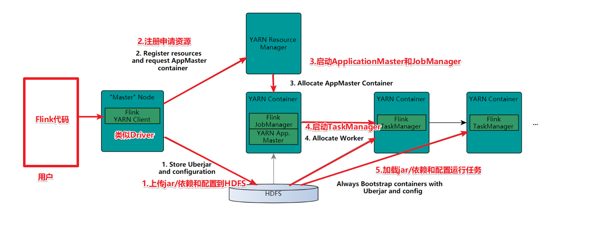
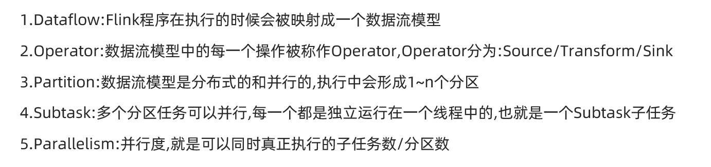
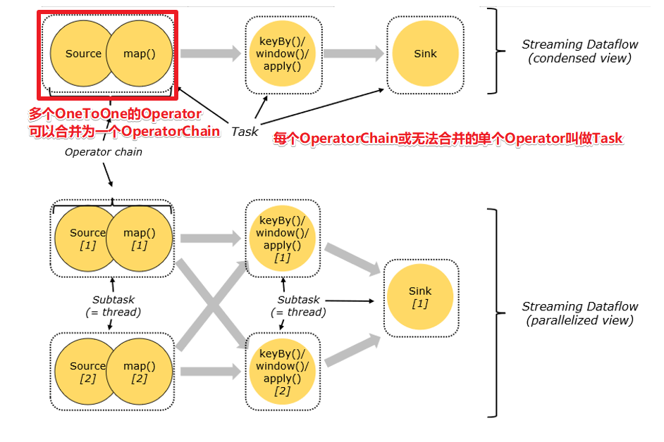
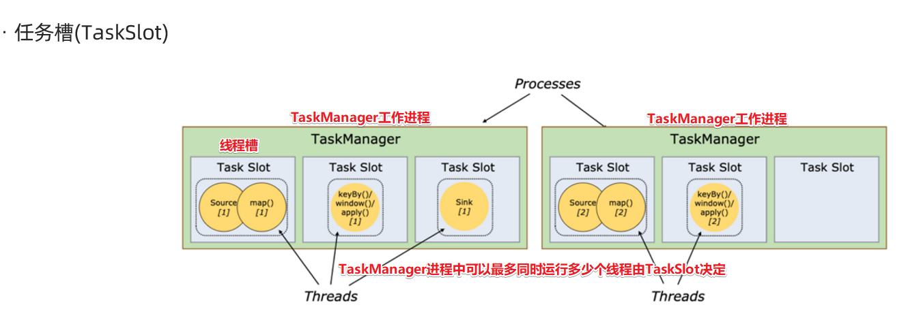
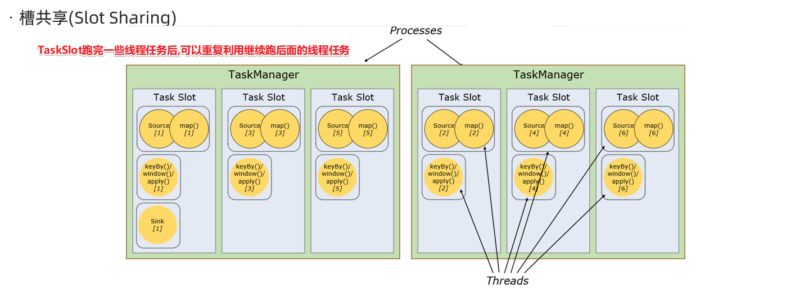
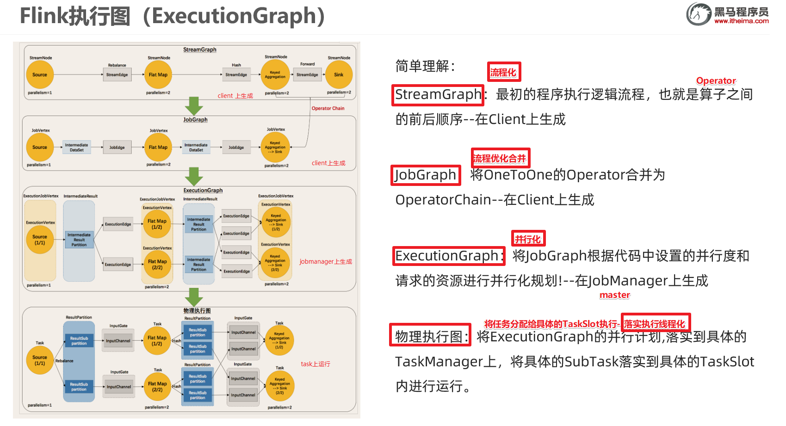

# Flink原理初探-慢慢理解/消化

## 角色分工

## 执行流程

## DataFlow

https://ci.apache.org/projects/flink/flink-docs-release-1.12/concepts/glossary.html

### DataFlow、Operator、Partition、Parallelism、SubTask

### OperatorChain和Task

### TaskSlot和TaskSlotSharing

## 执行流程图生成

