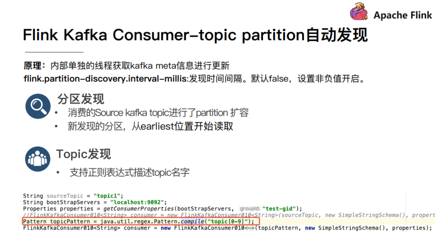

# Transformation（操作处理）

## 基本操作

map/flatMap/filter/keyBy/sum/reduce...

和之前学习的Scala/Spark里面的一样的意思

需求

对流数据中的单词进行统计，排除敏感词TMD(Theater Missile Defense 战区导弹防御)nc -lk 9999

```java
package cn.itcast.transformation;

import org.apache.flink.api.common.RuntimeExecutionMode;
import org.apache.flink.api.common.functions.FilterFunction;
import org.apache.flink.api.common.functions.FlatMapFunction;
import org.apache.flink.api.common.functions.MapFunction;
import org.apache.flink.api.common.functions.ReduceFunction;
import org.apache.flink.api.java.tuple.Tuple2;
import org.apache.flink.streaming.api.datastream.DataStream;
import org.apache.flink.streaming.api.datastream.KeyedStream;
import org.apache.flink.streaming.api.datastream.SingleOutputStreamOperator;
import org.apache.flink.streaming.api.environment.StreamExecutionEnvironment;
import org.apache.flink.util.Collector;

/**
 * Author itcast
 * Desc 演示DataStream-Transformation-基本操作
 */
public class TransformationDemo01 {
    public static void main(String[] args) throws Exception {
        //TODO 0.env
        StreamExecutionEnvironment env = StreamExecutionEnvironment.getExecutionEnvironment();
        env.setRuntimeMode(RuntimeExecutionMode.AUTOMATIC);

        //TODO 1.source
        DataStream<String> lines = env.socketTextStream("master", 9999);


        //TODO 2.transformation
        DataStream<String> words = lines.flatMap(new FlatMapFunction<String, String>() {
            @Override
            public void flatMap(String value, Collector<String> out) throws Exception {
                String[] arr = value.split(" ");
                for (String word : arr) {
                    out.collect(word);
                }
            }
        });

        DataStream<String> filted = words.filter(new FilterFunction<String>() {
            @Override
            public boolean filter(String value) throws Exception {
                return !value.equals("TMD");//如果是TMD则返回false表示过滤掉
            }
        });

        SingleOutputStreamOperator<Tuple2<String, Integer>> wordAndOne = filted.map(new MapFunction<String, Tuple2<String, Integer>>() {
            @Override
            public Tuple2<String, Integer> map(String value) throws Exception {
                return Tuple2.of(value, 1);
            }
        });

        KeyedStream<Tuple2<String, Integer>, String> grouped = wordAndOne.keyBy(t -> t.f0);

        //SingleOutputStreamOperator<Tuple2<String, Integer>> result = grouped.sum(1);

        SingleOutputStreamOperator<Tuple2<String, Integer>> result = grouped.reduce(new ReduceFunction<Tuple2<String, Integer>>() {
            @Override
            public Tuple2<String, Integer> reduce(Tuple2<String, Integer> value1, Tuple2<String, Integer> value2) throws Exception {
                //Tuple2<String, Integer> value1 :进来的(单词,历史值)
                //Tuple2<String, Integer> value2 :进来的(单词,1)
                //需要返回(单词,数量)
                return Tuple2.of(value1.f0, value1.f1 + value2.f1); //_+_
            }
        });

        //TODO 3.sink
        result.print();

        //TODO 4.execute
        env.execute();
    }
}

```


## 合并和连接


```java
package cn.itcast.transformation;

import org.apache.flink.api.common.RuntimeExecutionMode;
import org.apache.flink.streaming.api.datastream.ConnectedStreams;
import org.apache.flink.streaming.api.datastream.DataStream;
import org.apache.flink.streaming.api.datastream.SingleOutputStreamOperator;
import org.apache.flink.streaming.api.environment.StreamExecutionEnvironment;
import org.apache.flink.streaming.api.functions.co.CoMapFunction;

/**
 * Author itcast
 * Desc 演示DataStream-Transformation-合并和连接操作
 */
public class TransformationDemo02 {
    public static void main(String[] args) throws Exception {
        //TODO 0.env
        StreamExecutionEnvironment env = StreamExecutionEnvironment.getExecutionEnvironment();
        env.setRuntimeMode(RuntimeExecutionMode.AUTOMATIC);

        //TODO 1.source
        DataStream<String> ds1 = env.fromElements("hadoop", "spark", "flink");
        DataStream<String> ds2 = env.fromElements("hadoop", "spark", "flink");
        DataStream<Long> ds3 = env.fromElements(1L, 2L, 3L);

        //TODO 2.transformation
        DataStream<String> result1 = ds1.union(ds2);//注意union能合并同类型
        //ds1.union(ds3);//注意union不可以合并不同类型
        ConnectedStreams<String, String> result2 = ds1.connect(ds2);//注意:connet可以合并同类型
        ConnectedStreams<String, Long> result3 = ds1.connect(ds3);//注意connet可以合并不同类型

        /*
        public interface CoMapFunction<IN1, IN2, OUT> extends Function, Serializable {
            OUT map1(IN1 value) throws Exception;
            OUT map2(IN2 value) throws Exception;
        }
         */
        SingleOutputStreamOperator<String> result = result3.map(new CoMapFunction<String, Long, String>() {
            @Override
            public String map1(String value) throws Exception {
                return "String:" + value;
            }

            @Override
            public String map2(Long value) throws Exception {
                return "Long:" + value;
            }
        });


        //TODO 3.sink
        result1.print();
        //result2.print();//注意:connect之后需要做其他的处理,不能直接输出
        //result3.print();//注意:connect之后需要做其他的处理,不能直接输出
        result.print();

        //TODO 4.execute
        env.execute();
    }
}

```


## 拆分和选择

Split就是将一个流分成多个流
Select就是获取分流后对应的数据
注意：split函数已过期并移除
Side Outputs：可以使用process方法对流中数据进行处理，并针对不同的处理结果将数据收集到不同的OutputTag中

```java
package cn.itcast.transformation;

import org.apache.flink.api.common.RuntimeExecutionMode;
import org.apache.flink.api.common.typeinfo.TypeInformation;
import org.apache.flink.streaming.api.datastream.DataStream;
import org.apache.flink.streaming.api.datastream.DataStreamSource;
import org.apache.flink.streaming.api.datastream.SingleOutputStreamOperator;
import org.apache.flink.streaming.api.environment.StreamExecutionEnvironment;
import org.apache.flink.streaming.api.functions.ProcessFunction;
import org.apache.flink.util.Collector;
import org.apache.flink.util.OutputTag;

/**
 * Author itcast
 * Desc 演示DataStream-Transformation-拆分(split)和选择(select)操作
 * 注意split和select在flink1.12中已经过期并移除了
 * 所以得使用outPutTag和process来实现
 * 需求:对流中的数据按照奇数和偶数拆分并选择
 */
public class TransformationDemo03 {
    public static void main(String[] args) throws Exception {
        //TODO 0.env
        StreamExecutionEnvironment env = StreamExecutionEnvironment.getExecutionEnvironment();
        env.setRuntimeMode(RuntimeExecutionMode.AUTOMATIC);

        //TODO 1.source
        DataStreamSource<Integer> ds = env.fromElements(1, 2, 3, 4, 5, 6, 7, 8, 9, 10);

        //TODO 2.transformation
        //需求:对流中的数据按照奇数和偶数拆分并选择
        OutputTag<Integer> oddTag = new OutputTag<>("奇数", TypeInformation.of(Integer.class));
        OutputTag<Integer> evenTag = new OutputTag<>("偶数",TypeInformation.of(Integer.class));

        /*
        public abstract class ProcessFunction<I, O> extends AbstractRichFunction {
            public abstract void processElement(I value, ProcessFunction.Context ctx, Collector<O> out) throws Exception;
        }
         */
        SingleOutputStreamOperator<Integer> result = ds.process(new ProcessFunction<Integer, Integer>() {
            @Override
            public void processElement(Integer value, Context ctx, Collector<Integer> out) throws Exception {
                //out收集完的还是放在一起的,ctx可以将数据放到不同的OutputTag
                if (value % 2 == 0) {
                    ctx.output(evenTag, value);
                } else {
                    ctx.output(oddTag, value);
                }
            }
        });

        DataStream<Integer> oddResult = result.getSideOutput(oddTag);
        DataStream<Integer> evenResult = result.getSideOutput(evenTag);

        //TODO 3.sink
        System.out.println(oddTag);//OutputTag(Integer, 奇数)
        System.out.println(evenTag);//OutputTag(Integer, 偶数)
        oddResult.print("奇数:");
        evenResult.print("偶数:");

        //TODO 4.execute
        env.execute();
    }
}

```


## rebalance重平衡分区

解决数据倾斜的问题


```java
package cn.itcast.transformation;

import org.apache.flink.api.common.RuntimeExecutionMode;
import org.apache.flink.api.common.functions.FilterFunction;
import org.apache.flink.api.common.functions.RichMapFunction;
import org.apache.flink.api.java.tuple.Tuple2;
import org.apache.flink.streaming.api.datastream.DataStream;
import org.apache.flink.streaming.api.datastream.SingleOutputStreamOperator;
import org.apache.flink.streaming.api.environment.StreamExecutionEnvironment;

/**
 * Author itcast
 * Desc 演示DataStream-Transformation-rebalance-重平衡分区
 */
public class TransformationDemo04 {
    public static void main(String[] args) throws Exception {
        //TODO 0.env
        StreamExecutionEnvironment env = StreamExecutionEnvironment.getExecutionEnvironment();
        env.setRuntimeMode(RuntimeExecutionMode.AUTOMATIC);

        //TODO 1.source
        DataStream<Long> longDS = env.fromSequence(0, 100);
        //下面的操作相当于将数据随机分配一下,有可能出现数据倾斜
        DataStream<Long> filterDS = longDS.filter(new FilterFunction<Long>() {
            @Override
            public boolean filter(Long num) throws Exception {
                return num > 10;
            }
        });

        //TODO 2.transformation
        //没有经过rebalance有可能出现数据倾斜
        SingleOutputStreamOperator<Tuple2<Integer, Integer>> result1 = filterDS
                .map(new RichMapFunction<Long, Tuple2<Integer, Integer>>() {
                    @Override
                    public Tuple2<Integer, Integer> map(Long value) throws Exception {
                        int subTaskId = getRuntimeContext().getIndexOfThisSubtask();//子任务id/分区编号
                        return Tuple2.of(subTaskId, 1);
                    }
                    //按照子任务id/分区编号分组,并统计每个子任务/分区中有几个元素
                }).keyBy(t -> t.f0).sum(1);

        //调用了rebalance解决了数据倾斜
        SingleOutputStreamOperator<Tuple2<Integer, Integer>> result2 = filterDS.rebalance()
                .map(new RichMapFunction<Long, Tuple2<Integer, Integer>>() {
                    @Override
                    public Tuple2<Integer, Integer> map(Long value) throws Exception {
                        int subTaskId = getRuntimeContext().getIndexOfThisSubtask();//子任务id/分区编号
                        return Tuple2.of(subTaskId, 1);
                    }
                    //按照子任务id/分区编号分组,并统计每个子任务/分区中有几个元素
                }).keyBy(t -> t.f0).sum(1);


        //TODO 3.sink
        result1.print("result1");
        result2.print("result2");


        //TODO 4.execute
        env.execute();
    }
}

```

## 其他分区操作


```java
package cn.itcast.transformation;

        import org.apache.flink.api.common.RuntimeExecutionMode;
        import org.apache.flink.api.common.functions.FlatMapFunction;
        import org.apache.flink.api.common.functions.Partitioner;
        import org.apache.flink.api.java.tuple.Tuple2;
        import org.apache.flink.streaming.api.datastream.DataStream;
        import org.apache.flink.streaming.api.datastream.SingleOutputStreamOperator;
        import org.apache.flink.streaming.api.environment.StreamExecutionEnvironment;
        import org.apache.flink.util.Collector;

/**
 * Author itcast
 * Desc 演示DataStream-Transformation-各种分区
 */
public class TransformationDemo05 {
    public static void main(String[] args) throws Exception {
        //TODO 0.env
        StreamExecutionEnvironment env = StreamExecutionEnvironment.getExecutionEnvironment();
        env.setRuntimeMode(RuntimeExecutionMode.AUTOMATIC);

        //TODO 1.source
        DataStream<String> linesDS = env.readTextFile("data/input/words.txt");
        SingleOutputStreamOperator<Tuple2<String, Integer>> tupleDS = linesDS.flatMap(new FlatMapFunction<String, Tuple2<String, Integer>>() {
            @Override
            public void flatMap(String value, Collector<Tuple2<String, Integer>> out) throws Exception {
                String[] words = value.split(" ");
                for (String word : words) {
                    out.collect(Tuple2.of(word, 1));
                }
            }
        });

        //TODO 2.transformation
        DataStream<Tuple2<String, Integer>> result1 = tupleDS.global();
        DataStream<Tuple2<String, Integer>> result2 = tupleDS.broadcast();
        DataStream<Tuple2<String, Integer>> result3 = tupleDS.forward();
        DataStream<Tuple2<String, Integer>> result4 = tupleDS.shuffle();
        DataStream<Tuple2<String, Integer>> result5 = tupleDS.rebalance();
        DataStream<Tuple2<String, Integer>> result6 = tupleDS.rescale();
        DataStream<Tuple2<String, Integer>> result7 = tupleDS.partitionCustom(new MyPartitioner(), t -> t.f0);


        //TODO 3.sink
        result1.print("result1");
        result2.print("result2");
        result3.print("result3");
        result4.print("result4");
        result5.print("result5");
        result6.print("result6");
        result7.print("result7");


        //TODO 4.execute
        env.execute();
    }
    public static class MyPartitioner implements Partitioner<String>{
        @Override
        public int partition(String key, int numPartitions) {
            //if(key.equals("北京")) return 0;  这里写自己的分区逻辑即可
            return 0;
        }
    }
}

```

# Sink（输出）

## 基于控制台和文件

API
1.ds.print 直接输出到控制台
2.ds.printToErr() 直接输出到控制台,用红色
3.ds.writeAsText("本地/HDFS的path", WriteMode.OVERWRITE).setParallelism(1)
注意:
在输出到path的时候,可以在前面设置并行度,如果
**并行度>1,则path为目录**
**并行度=1,则path为文件名**

```java
package cn.itcast.sink;

import org.apache.flink.api.common.RuntimeExecutionMode;
import org.apache.flink.streaming.api.datastream.DataStream;
import org.apache.flink.streaming.api.environment.StreamExecutionEnvironment;

/**
 * Author itcast
 * Desc 演示DataStream-Sink-基于控制台和文件
 */
public class SinkDemo01 {
    public static void main(String[] args) throws Exception {
        //TODO 0.env
        StreamExecutionEnvironment env = StreamExecutionEnvironment.getExecutionEnvironment();
        env.setRuntimeMode(RuntimeExecutionMode.AUTOMATIC);

        //TODO 1.source
        DataStream<String> ds = env.readTextFile("data/input/words.txt");

        //TODO 2.transformation


        //TODO 3.sink
        ds.print();
        ds.print("输出标识");
        ds.printToErr();//会在控制台上以红色输出
        ds.printToErr("输出标识");//会在控制台上以红色输出
        ds.writeAsText("data/output/result1").setParallelism(1);//为文件名
        ds.writeAsText("data/output/result2").setParallelism(2);//为目录

        //TODO 4.execute
        env.execute();
    }
}
```


## 自定义Sink

### MySQL

需求：将Flink集合中的数据通过自定义Sink保存到MySQL

```java
package cn.itcast.sink;

import lombok.AllArgsConstructor;
import lombok.Data;
import lombok.NoArgsConstructor;
import org.apache.flink.api.common.RuntimeExecutionMode;
import org.apache.flink.configuration.Configuration;
import org.apache.flink.streaming.api.datastream.DataStream;
import org.apache.flink.streaming.api.environment.StreamExecutionEnvironment;
import org.apache.flink.streaming.api.functions.sink.RichSinkFunction;

import java.sql.Connection;
import java.sql.DriverManager;
import java.sql.PreparedStatement;

/**
 * Author itcast
 * Desc 演示DataStream-Sink-自定义Sink
 */
public class SinkDemo02 {
    public static void main(String[] args) throws Exception {
        //TODO 0.env
        StreamExecutionEnvironment env = StreamExecutionEnvironment.getExecutionEnvironment();
        env.setRuntimeMode(RuntimeExecutionMode.AUTOMATIC);

        //TODO 1.source
        DataStream<Student> studentDS = env.fromElements(new Student(null, "tony", 18));
        //TODO 2.transformation
        //TODO 3.sink
        studentDS.addSink(new MySQLSink());

        //TODO 4.execute
        env.execute();
    }
    @Data
    @NoArgsConstructor
    @AllArgsConstructor
    public static class Student {
        private Integer id;
        private String name;
        private Integer age;
    }

    public static class MySQLSink extends RichSinkFunction<Student> {
        private Connection conn = null;
        private PreparedStatement ps =null;

        @Override
        public void open(Configuration parameters) throws Exception {
            conn = DriverManager.getConnection("jdbc:mysql://localhost:3306/test", "root", "root");
            String sql = "INSERT INTO `first_test` (`id`, `name`, `age`) VALUES (null, ?, ?);";
            ps = conn.prepareStatement(sql);
        }

        @Override
        public void invoke(Student value, Context context) throws Exception {
            //设置?占位符参数值
            ps.setString(1,value.getName());
            ps.setInt(2,value.getAge());
            //执行sql
            ps.executeUpdate();
        }
        @Override
        public void close() throws Exception {
            if(conn != null) conn.close();
            if(ps != null) ps.close();
        }
    }
}
```

# Connectors（连接）

## JDBC

```java
package cn.itcast.connectors;

import lombok.AllArgsConstructor;
import lombok.Data;
import lombok.NoArgsConstructor;
import org.apache.flink.api.common.RuntimeExecutionMode;
import org.apache.flink.connector.jdbc.JdbcConnectionOptions;
import org.apache.flink.connector.jdbc.JdbcSink;
import org.apache.flink.streaming.api.datastream.DataStream;
import org.apache.flink.streaming.api.environment.StreamExecutionEnvironment;

/**
 * Author itcast
 * Desc 演示Flink官方提供的JdbcSink
 */
public class JDBCDemo {
    public static void main(String[] args) throws Exception {
        //TODO 0.env
        StreamExecutionEnvironment env = StreamExecutionEnvironment.getExecutionEnvironment();
        env.setRuntimeMode(RuntimeExecutionMode.AUTOMATIC);

        //TODO 1.source
        DataStream<Student> studentDS = env.fromElements(new Student(null, "tony2", 18));
        //TODO 2.transformation
        //TODO 3.sink
        studentDS.addSink(JdbcSink.sink(
                "INSERT INTO `first_test` (`id`, `name`, `age`) VALUES (null, ?, ?)",
                (ps, value) -> {
                    ps.setString(1, value.getName());
                    ps.setInt(2, value.getAge());
                }, new JdbcConnectionOptions.JdbcConnectionOptionsBuilder()
                        .withUrl("jdbc:mysql://localhost:3306/test")
                        .withUsername("root")
                        .withPassword("root")
                        .withDriverName("com.mysql.jdbc.Driver")
                        .build()));

        //TODO 4.execute
        env.execute();
    }

    @Data
    @NoArgsConstructor
    @AllArgsConstructor
    public static class Student {
        private Integer id;
        private String name;
        private Integer age;
    }

}

```

## Kafka Consumer/Source


参数

env.addSource(new Kafka Consumer/Source(参数))

以下参数都必须/建议设置上

1. 订阅的主题
2. 反序列化规则
3. 消费者属性-集群地址
4. 消费者属性-消费者组id(如果不设置,会有默认的,但是默认的不方便管理)
5. 消费者属性-offset重置规则,如earliest/latest...
6. 动态分区检测(当kafka的分区数变化/增加时,Flink能够检测到!)
7. 如果没有设置Checkpoint,那么可以设置自动提交offset,后续学习了Checkpoint会把offset随着做Checkpoint的时候提交到Checkpoint和默认主题中




### Kafka命令

```shell
# 查看当前服务器中的所有topic
kafka-topics.sh --list --zookeeper  master:2181
# 创建topic
kafka-topics.sh --create --zookeeper master:2181 --replication-factor 2 --partitions 3 --topic flink_kafka
# 查看某个Topic的详情
kafka-topics.sh --topic flink_kafka --describe --zookeeper master:2181
# 删除topic
kafka-topics.sh --delete --zookeeper master:2181 --topic flink_kafka
# 通过shell命令发送消息
kafka-console-producer.sh --broker-list master:9092 --topic flink_kafka
# 通过shell消费消息
kafka-console-consumer.sh --bootstrap-server master:9092 --topic flink_kafka --from-beginning 
# 修改分区
kafka-topics.sh --alter --partitions 4 --topic flink_kafka --zookeeper master:2181
```

```java
package cn.itcast.connectors;

import lombok.AllArgsConstructor;
import lombok.Data;
import lombok.NoArgsConstructor;
import org.apache.flink.api.common.RuntimeExecutionMode;
import org.apache.flink.api.common.serialization.SimpleStringSchema;
import org.apache.flink.connector.jdbc.JdbcConnectionOptions;
import org.apache.flink.connector.jdbc.JdbcSink;
import org.apache.flink.streaming.api.datastream.DataStream;
import org.apache.flink.streaming.api.environment.StreamExecutionEnvironment;
import org.apache.flink.streaming.connectors.kafka.FlinkKafkaConsumer;

import java.util.Properties;

/**
 * Author itcast
 * Desc 演示Flink-Connectors-KafkaComsumer/Source
 */

public class KafkaComsumerDemo {
    public static void main(String[] args) throws Exception {
        //TODO 0.env
        StreamExecutionEnvironment env = StreamExecutionEnvironment.getExecutionEnvironment();
        env.setRuntimeMode(RuntimeExecutionMode.AUTOMATIC);

        //TODO 1.source     添加各属性
        Properties props = new Properties();
        props.setProperty("bootstrap.servers", "master:9092");       //集群地址
        props.setProperty("group.id", "flink");                 //消费者ID
        props.setProperty("auto.offset.reset", "latest");
        //latest有offset记录从记录位置开始消费,没有记录从最新的/最后的消息开始消费 /earliest有offset记录从记录位置开始消费,没有记录从最早的/最开始的消息开始消费
        props.setProperty("flink.partition-discovery.interval-millis","5000");
        //会开启一个后台线程每隔5s检测一下Kafka的分区情况,实现动态分区检测
        props.setProperty("enable.auto.commit", "true");
        //自动提交(提交到默认主题,后续学习了Checkpoint后随着Checkpoint存储在Checkpoint和默认主题中)
        props.setProperty("auto.commit.interval.ms", "2000");   //自动提交的时间间隔

        //使用连接参数创建FlinkKafkaConsumer/kafkaSource
        FlinkKafkaConsumer<String> kafkaSource = new FlinkKafkaConsumer<String>("flink_kafka", new SimpleStringSchema(), props);
        //使用kafkaSource
        DataStream<String> kafkaDS = env.addSource(kafkaSource);


        //TODO 2.transformation


        //TODO 3.sink
        kafkaDS.print();

        //TODO 4.execute
        env.execute();

    }
}

// 准备主题kafka-topics.sh --create --zookeeper master:2181 --replication-factor 2 --partitions 3 --topic flink_kafka
// 启动控制台生产者发送数据 kafka-console-producer.sh --broker-list master:9092 --topic flink_kafka
// 启动程序FlinkKafkaConsumer
// 观察控制台输出结果
```


中途出现的问题

```cmd
Caused by: org.apache.kafka.common.config.ConfigException: No resolvable bootstrap urls given in bootstrap.servers
	at org.apache.kafka.clients.ClientUtils.parseAndValidateAddresses(ClientUtils.java:88)
	at org.apache.kafka.clients.ClientUtils.parseAndValidateAddresses(ClientUtils.java:47)
	at org.apache.kafka.clients.consumer.KafkaConsumer.<init>(KafkaConsumer.java:735)
	... 17 more
	
# 错误原因：bootstrap.servers 打错了
```

## Kafka Producer/Sink

控制台生成者 ---> flink_kafka主题 --> Flink -->etl ---> flink_kafka2主题--->控制台消费者

```java
package cn.itcast.connectors;

import org.apache.flink.api.common.RuntimeExecutionMode;
import org.apache.flink.api.common.functions.FilterFunction;
import org.apache.flink.api.common.serialization.SimpleStringSchema;
import org.apache.flink.streaming.api.datastream.DataStream;
import org.apache.flink.streaming.api.datastream.SingleOutputStreamOperator;
import org.apache.flink.streaming.api.environment.StreamExecutionEnvironment;
import org.apache.flink.streaming.connectors.kafka.FlinkKafkaConsumer;
import org.apache.flink.streaming.connectors.kafka.FlinkKafkaProducer;

import java.util.Properties;

/**
 * Author itcast
 * Desc 演示Flink-Connectors-KafkaComsumer/Source + KafkaProducer/Sink
 */
public class KafkaSinkDemo {
    public static void main(String[] args) throws Exception {
        //TODO 0.env
        StreamExecutionEnvironment env = StreamExecutionEnvironment.getExecutionEnvironment();
        env.setRuntimeMode(RuntimeExecutionMode.AUTOMATIC);

        //TODO 1.source
        //准备kafka连接参数
        Properties props  = new Properties();
        props.setProperty("bootstrap.servers", "master:9092");//集群地址
        props.setProperty("group.id", "flink");//消费者组id
        props.setProperty("auto.offset.reset","latest");//latest有offset记录从记录位置开始消费,没有记录从最新的/最后的消息开始消费 /earliest有offset记录从记录位置开始消费,没有记录从最早的/最开始的消息开始消费
        props.setProperty("flink.partition-discovery.interval-millis","5000");//会开启一个后台线程每隔5s检测一下Kafka的分区情况,实现动态分区检测
        props.setProperty("enable.auto.commit", "true");//自动提交(提交到默认主题,后续学习了Checkpoint后随着Checkpoint存储在Checkpoint和默认主题中)
        props.setProperty("auto.commit.interval.ms", "2000");//自动提交的时间间隔
        //使用连接参数创建FlinkKafkaConsumer/kafkaSource
        FlinkKafkaConsumer<String> kafkaSource = new FlinkKafkaConsumer<String>("flink_kafka", new SimpleStringSchema(), props);
        //使用kafkaSource
        DataStream<String> kafkaDS = env.addSource(kafkaSource);

        //TODO 2.transformation
        SingleOutputStreamOperator<String> etlDS = kafkaDS.filter(new FilterFunction<String>() {
            @Override
            public boolean filter(String value) throws Exception {
                return value.contains("success");
            }
        });

        //TODO 3.sink
        etlDS.print();

        Properties props2 = new Properties();
        props2.setProperty("bootstrap.servers", "master:9092");
        FlinkKafkaProducer<String> kafkaSink = new FlinkKafkaProducer<>("flink_kafka2", new SimpleStringSchema(), props2);
        etlDS.addSink(kafkaSink);

        //TODO 4.execute
        env.execute();
    }
}
//控制台生成者 ---> flink_kafka主题 --> Flink -->etl ---> flink_kafka2主题--->控制台消费者
//准备主题 kafka-topics.sh --create --zookeeper master:2181 --replication-factor 2 --partitions 3 --topic flink_kafka
//准备主题 kafka-topics.sh --create --zookeeper master:2181 --replication-factor 2 --partitions 3 --topic flink_kafka2
//启动控制台生产者发送数据 kafka-console-producer.sh --broker-list master:9092 --topic flink_kafka
//log:2020-10-10 success xxx
//log:2020-10-10 success xxx
//log:2020-10-10 success xxx
//log:2020-10-10 fail xxx
//启动控制台消费者消费数据 kafka-console-consumer.sh --bootstrap-server master:9092 --topic flink_kafka2 --from-beginning
//启动程序FlinkKafkaConsumer
//观察控制台输出结果

```


