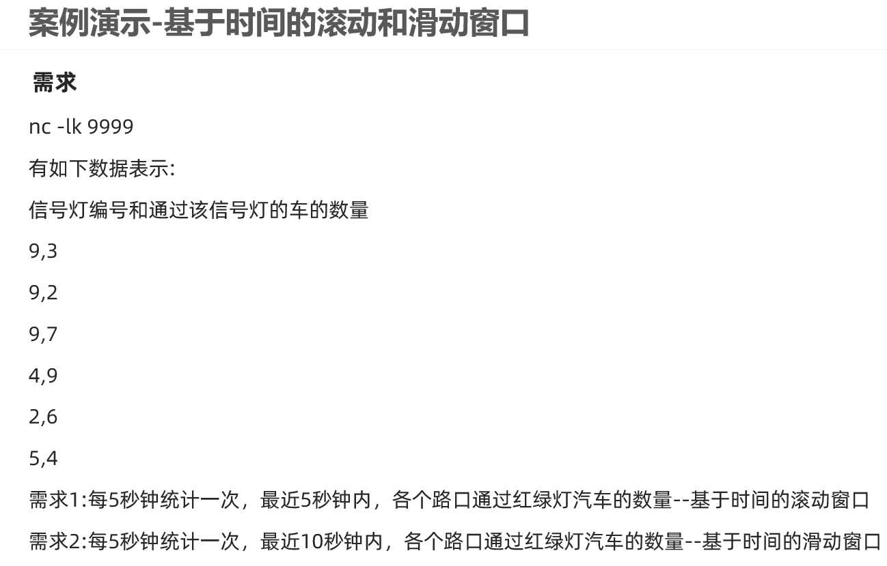
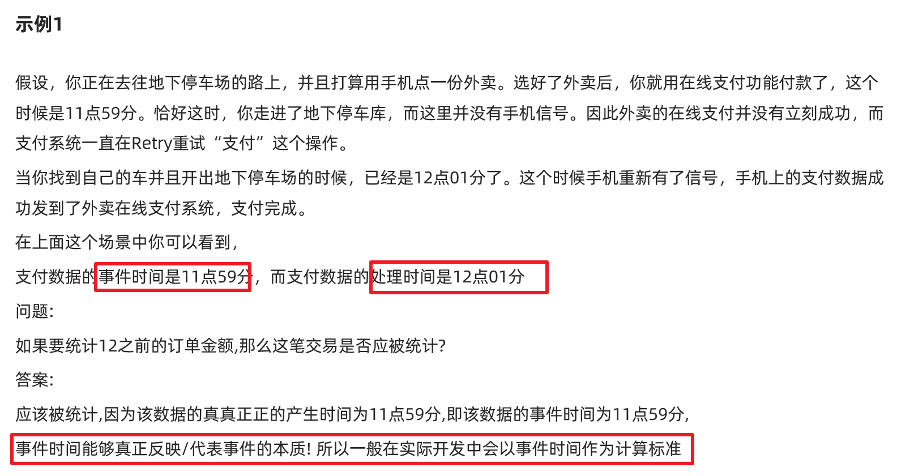
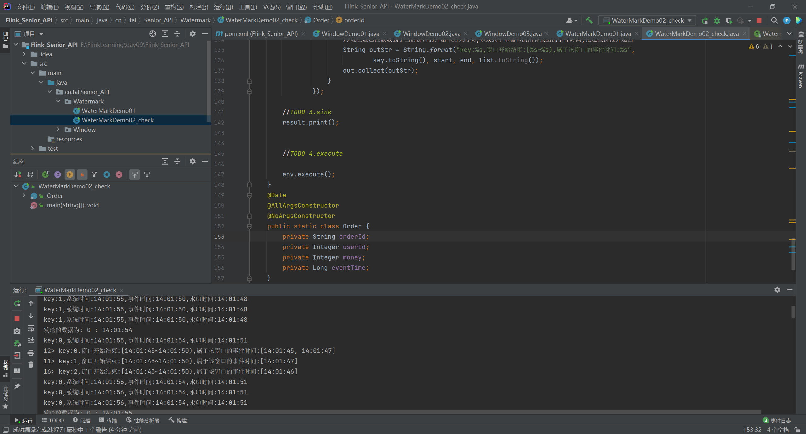

# Flink四大基石


# Window

在流处理应用中，数据是连续不断的，有时我们需要做一些聚合类的处理，例如：在过去的1分钟内有多少用户点击了我们的网页。
在这种情况下，我们必须定义一个窗口(window)，用来收集最近1分钟内的数据，并对这个窗口内的数据进行计算。

## 窗口的分类

### 按照time和count分类

time-window:时间窗口:根据时间划分窗口,如:每xx分钟统计最近xx分钟的数据
count-window:数量窗口:根据数量划分窗口,如:每xx个数据统计最近xx个数据


### 按照slide和size分类

窗口有两个重要的属性: 窗口大小size和滑动间隔slide,根据它们的大小关系可分为:
tumbling-window:滚动窗口:size=slide,如:每隔10s统计最近10s的数据
sliding-window:滑动窗口:size>slide,如:每隔5s统计最近10s的数据

 


基于时间的滑动窗口(掌握)

基于时间的滚动窗口(掌握)

基于数量的滑动窗口(了解)

基于数量的滚动窗口(了解)


## API


## 代码演示-基于时间的滚动和滑动-掌握



```java
package cn.tal.Senior_API.Window;
/*
    @TODO:  演示基于时间的滚动和滑动窗口
    @Author tal
*/

import lombok.AllArgsConstructor;
import lombok.Data;
import lombok.NoArgsConstructor;
import org.apache.flink.api.common.RuntimeExecutionMode;
import org.apache.flink.api.common.functions.MapFunction;
import org.apache.flink.streaming.api.datastream.DataStreamSource;
import org.apache.flink.streaming.api.datastream.KeyedStream;
import org.apache.flink.streaming.api.datastream.SingleOutputStreamOperator;
import org.apache.flink.streaming.api.environment.StreamExecutionEnvironment;
import org.apache.flink.streaming.api.windowing.assigners.TumblingProcessingTimeWindows;
import org.apache.flink.streaming.api.windowing.time.Time;
import org.jboss.netty.channel.UpstreamChannelStateEvent;

public class WindowDemo01 {
    public static void main(String[] args) throws Exception {
        //TODO 0.env
            StreamExecutionEnvironment env = StreamExecutionEnvironment.getExecutionEnvironment();
            env.setRuntimeMode(RuntimeExecutionMode.AUTOMATIC);

        //TODO 1.source
        DataStreamSource<String> lines = env.socketTextStream("master", 9999);

        //TODO 2.transformation
        SingleOutputStreamOperator<CartInfo> carDS = lines.map(new MapFunction<String, CartInfo>() {
            @Override
            public CartInfo map(String value) throws Exception {
                String[] arr = value.split(",");
                return new CartInfo(arr[0], Integer.parseInt(arr[1]));
            }
        });

        //注意: 需求中要求的是各个路口/红绿灯的结果,所以需要先分组
        //carDS.keyBy(car->car.getSensorId())
        KeyedStream<CartInfo, String> keyedDS = carDS.keyBy(CartInfo::getSensorId);

        // * 需求1:每5秒钟统计一次，最近5秒钟内，各个路口通过红绿灯汽车的数量--基于时间的滚动窗口
        //keyedDS.timeWindow(Time.seconds(5)) 已过期
        SingleOutputStreamOperator<CartInfo> result1 = keyedDS
                .window(TumblingProcessingTimeWindows
                .of(Time.seconds(5))).sum("count");
        // TumblingProcessingTimeWindows 处理时间，一个参数为滚动，两个参数为滑动,第一个参数为统计多少时间内的数据，后一个是多久统计一次

        // * 需求2:每5秒钟统计一次，最近10秒钟内，各个路口通过红绿灯汽车的数量--基于时间的滑动窗口
        SingleOutputStreamOperator<CartInfo> result2 = keyedDS
                .window(TumblingProcessingTimeWindows
                .of(Time.seconds(10),Time.seconds(5))).sum("count");

        //TODO 3.sink
        result1.print();
        result2.print();
        /*
        1,5
        2,5
        3,5
        4,5
        */

        //TODO 4.execute

        env.execute();

    }

    @Data
    @AllArgsConstructor
    @NoArgsConstructor
    public static class CartInfo{
        private String sensorId;    //信号灯ID
        private Integer count;      //通过信号灯的车数量
    }


}

```

## 代码演示-基于数量的滚动和滑动


```java
package cn.tal.Senior_API.Window;
/*
    @TODO:  演示基于数量的滚动和滑动窗口
    @Author tal
*/

import lombok.AllArgsConstructor;
import lombok.Data;
import lombok.NoArgsConstructor;
import org.apache.flink.api.common.RuntimeExecutionMode;
import org.apache.flink.api.common.functions.MapFunction;
import org.apache.flink.streaming.api.datastream.DataStreamSource;
import org.apache.flink.streaming.api.datastream.KeyedStream;
import org.apache.flink.streaming.api.datastream.SingleOutputStreamOperator;
import org.apache.flink.streaming.api.environment.StreamExecutionEnvironment;
import org.apache.flink.streaming.api.windowing.assigners.TumblingProcessingTimeWindows;
import org.apache.flink.streaming.api.windowing.time.Time;

public class WindowDemo02 {
    public static void main(String[] args) throws Exception {
        //TODO 0.env
            StreamExecutionEnvironment env = StreamExecutionEnvironment.getExecutionEnvironment();
            env.setRuntimeMode(RuntimeExecutionMode.AUTOMATIC);

        //TODO 1.source
        DataStreamSource<String> lines = env.socketTextStream("master", 9999);

        //TODO 2.transformation
        SingleOutputStreamOperator<CartInfo> carDS = lines.map(new MapFunction<String, CartInfo>() {
            @Override
            public CartInfo map(String value) throws Exception {
                String[] arr = value.split(",");
                return new CartInfo(arr[0], Integer.parseInt(arr[1]));
            }
        });

        //注意: 需求中要求的是各个路口/红绿灯的结果,所以需要先分组
        //carDS.keyBy(car->car.getSensorId())
        KeyedStream<CartInfo, String> keyedDS = carDS.keyBy(CartInfo::getSensorId);

        // * 需求1:统计在最近5条消息中,各自路口通过的汽车数量,相同的key每出现5次进行统计--基于数量的滚动窗口
        //keyedDS.timeWindow(Time.seconds(5)) 已过期
        SingleOutputStreamOperator<CartInfo> result1 = keyedDS
                .countWindow(5)
                .sum("count");

        // * 需求2:统计在最近5条消息中,各自路口通过的汽车数量,相同的key每出现3次进行统计--基于数量的滑动窗口
                SingleOutputStreamOperator<CartInfo> result2 = keyedDS
                        .countWindow(5,3)
                        .sum("count");

        //TODO 3.sink
        result1.print();
        /*
        1,1
        1,1
        1,1
        1,1
        2,1
        1,1
         */
        result2.print();
        /*
        1,1
        1,1
        2,1
        1,1
        2,1
        3,1
        4,1
         */

        //TODO 4.execute

        env.execute();

    }

    @Data
    @AllArgsConstructor
    @NoArgsConstructor
    public static class CartInfo{
        private String sensorId;    //信号灯ID
        private Integer count;      //通过信号灯的车数量
    }


}

```


## 代码演示-Session会话窗口


```java
package cn.tal.Senior_API.Window;
/*
    @TODO:  演示会话窗口
    @Author tal
*/

import lombok.AllArgsConstructor;
import lombok.Data;
import lombok.NoArgsConstructor;
import org.apache.flink.api.common.RuntimeExecutionMode;
import org.apache.flink.api.common.functions.MapFunction;
import org.apache.flink.streaming.api.datastream.DataStreamSource;
import org.apache.flink.streaming.api.datastream.KeyedStream;
import org.apache.flink.streaming.api.datastream.SingleOutputStreamOperator;
import org.apache.flink.streaming.api.environment.StreamExecutionEnvironment;
import org.apache.flink.streaming.api.windowing.assigners.ProcessingTimeSessionWindows;
import org.apache.flink.streaming.api.windowing.time.Time;

public class WindowDemo03 {
    public static void main(String[] args) throws Exception {
        //TODO 0.env
            StreamExecutionEnvironment env = StreamExecutionEnvironment.getExecutionEnvironment();
            env.setRuntimeMode(RuntimeExecutionMode.AUTOMATIC);

        //TODO 1.source
        DataStreamSource<String> lines = env.socketTextStream("master", 9999);

        //TODO 2.transformation
        SingleOutputStreamOperator<CartInfo> carDS = lines.map(new MapFunction<String, CartInfo>() {
            @Override
            public CartInfo map(String value) throws Exception {
                String[] arr = value.split(",");
                return new CartInfo(arr[0], Integer.parseInt(arr[1]));
            }
        });

        //注意: 需求中要求的是各个路口/红绿灯的结果,所以需要先分组
        //carDS.keyBy(car->car.getSensorId())
        KeyedStream<CartInfo, String> keyedDS = carDS.keyBy(CartInfo::getSensorId);

        //需求:设置会话超时时间为10s,10s内没有数据到来,则触发上个窗口的计算(前提是上一个窗口得有数据!)
        SingleOutputStreamOperator<CartInfo> result = keyedDS
                .window(ProcessingTimeSessionWindows
                .withGap((Time.seconds(10))))
                .sum("count");


        //TODO 3.sink
        result.print();
        /*
        1,1
        1,1
        2,1
        2,1
         */

        //TODO 4.execute

        env.execute();

    }

    @Data
    @AllArgsConstructor
    @NoArgsConstructor
    public static class CartInfo{
        private String sensorId;    //信号灯ID
        private Integer count;      //通过信号灯的车数量
    }


}

```


# Time(Watermaker)

## 时间分类


## EventTime的重要性和Watermarker的引入




## Watermaker详解

==总结:==

1.Watermaker本质是时间戳

2.Watermaker = 当前进来的数据最大的事件时间 - 最大允许的数据延迟时间或乱序时间

3.Watermaker 可以通过改变窗口触发计算时机来解决一定程度上的数据乱序或延迟达到的问题

4.Watermaker  >= 窗口结束时间 时触发窗口计算

5.当前的最大的事件时间 - 最大允许的数据延迟时间或乱序时间>= 窗口结束时间时触发窗口计算

6.当前的最大的事件时间 >= 窗口结束时间 +最大允许的数据延迟时间或乱序时间时触发窗口计算


 


## 代码演示-开发版-掌握


https://ci.apache.org/projects/flink/flink-docs-release-1.12/dev/event_timestamps_watermarks.html

```java
package cn.tal.Senior_API.Watermark;
/*
    @TODO: 演示基于事件时间的窗口计算+Watermaker解决一定程度上的数据乱序/延迟到达的问题
    @Author tal
*/

import lombok.AllArgsConstructor;
import lombok.Data;
import lombok.NoArgsConstructor;
import org.apache.flink.api.common.RuntimeExecutionMode;
import org.apache.flink.api.common.eventtime.WatermarkStrategy;
import org.apache.flink.streaming.api.datastream.DataStreamSource;
import org.apache.flink.streaming.api.datastream.SingleOutputStreamOperator;
import org.apache.flink.streaming.api.environment.StreamExecutionEnvironment;
import org.apache.flink.streaming.api.functions.source.SourceFunction;
import org.apache.flink.streaming.api.windowing.assigners.TumblingEventTimeWindows;
import org.apache.flink.streaming.api.windowing.time.Time;

import java.time.Duration;
import java.util.Random;
import java.util.UUID;

public class WaterMarkDemo01 {
    public static void main(String[] args) throws Exception {

        //TODO 0.env
            StreamExecutionEnvironment env = StreamExecutionEnvironment.getExecutionEnvironment();
            env.setRuntimeMode(RuntimeExecutionMode.AUTOMATIC);

        //TODO 1.source
        DataStreamSource<Order> orderDS = env.addSource(new SourceFunction<Order>() {
            private boolean flag = true;

            @Override
            public void run(SourceContext<Order> ctx) throws Exception {
                Random random = new Random();
                while (flag) {
                    String orderId = UUID.randomUUID().toString();
                    int userId = random.nextInt(2);
                    int money = random.nextInt(101);
                    // 随机模拟延迟
                    long eventTime = System.currentTimeMillis() - random.nextInt(5) * 1000;
                    //currentTimeMillis()时间戳-随机短暂时间，模拟延时
                    ctx.collect(new Order(orderId, userId, money, eventTime));
                    Thread.sleep(1000);
                }
            }

            @Override
            public void cancel() {
                flag = false;
            }
        });

        //TODO 2.transformation
        //每隔5s计算最近5s的数据求每个用户的订单总金额,要求:基于事件时间进行窗口计算+Watermaker
        //env.setStreamTimeCharacteristic(TimeCharacteristic.EventTime);//在新版本中默认就是EventTime
        //设置Watermaker = 当前最大的事件时间 - 最大允许的延迟时间或乱序时间

        SingleOutputStreamOperator<Order> orderDSWithWatermark = orderDS
                .assignTimestampsAndWatermarks(WatermarkStrategy
                //指定事件时间和水印策略
                .<Order>forBoundedOutOfOrderness(Duration.ofSeconds(3))
                //指定maxOutOfOrderness最大无序度/最大允许的延迟时间/乱序时间
                .withTimestampAssigner((order, timestamp) -> order.getEventTime())
                //指定事件时间列
        );

        SingleOutputStreamOperator<Order> result = orderDSWithWatermark.keyBy(Order::getUserId)
                .window(TumblingEventTimeWindows.of(Time.seconds(5)))
                .sum("money");

        //TODO 3.sink
        result.print();


        //TODO 4.execute

        env.execute();
    }
    @Data
    @AllArgsConstructor
    @NoArgsConstructor
    public static class Order {
        private String orderId;
        private Integer userId;
        private Integer money;
        private Long eventTime;
    }


}

```


## 代码演示-验证版-了解

通过源码和下面的代码可以验证


```java
package cn.tal.Senior_API.Watermark;
/*
    @TODO:
    模拟实时订单数据,格式为: (订单ID，用户ID，订单金额，时间戳/事件时间)
    要求每隔5s,计算5秒内(基于时间的滚动窗口)，每个用户的订单总金额
    并添加Watermaker来解决一定程度上的数据延迟和数据乱序问题。
    @Author tal
*/

import lombok.AllArgsConstructor;
import lombok.Data;
import lombok.NoArgsConstructor;
import org.apache.commons.lang3.time.FastDateFormat;
import org.apache.flink.api.common.RuntimeExecutionMode;
import org.apache.flink.api.common.eventtime.*;
import org.apache.flink.streaming.api.datastream.DataStream;
import org.apache.flink.streaming.api.datastream.DataStreamSource;
import org.apache.flink.streaming.api.datastream.SingleOutputStreamOperator;
import org.apache.flink.streaming.api.environment.StreamExecutionEnvironment;
import org.apache.flink.streaming.api.functions.source.SourceFunction;
import org.apache.flink.streaming.api.functions.windowing.WindowFunction;
import org.apache.flink.streaming.api.windowing.assigners.TumblingEventTimeWindows;
import org.apache.flink.streaming.api.windowing.time.Time;
import org.apache.flink.streaming.api.windowing.windows.TimeWindow;
import org.apache.flink.util.Collector;

import java.util.ArrayList;
import java.util.List;
import java.util.Random;
import java.util.UUID;

public class WaterMarkDemo02_check {
    public static void main(String[] args) throws Exception {
        FastDateFormat df = (FastDateFormat) FastDateFormat.getInstance("HH:mm:ss");

        //TODO 0.env
            StreamExecutionEnvironment env = StreamExecutionEnvironment.getExecutionEnvironment();
            env.setRuntimeMode(RuntimeExecutionMode.AUTOMATIC);

        //TODO 1.source
        //模拟实时订单数据(数据有延迟和乱序)
        DataStreamSource<Order> orderDS = env.addSource(new SourceFunction<Order>() {
            private boolean flag = true;

            @Override
            public void run(SourceContext<Order> ctx) throws Exception {
                Random random = new Random();
                while (flag) {
                    String orderId = UUID.randomUUID().toString();
                    int userId = random.nextInt(3);
                    int money = random.nextInt(101);
                    // 随机模拟延迟
                    long eventTime = System.currentTimeMillis() - random.nextInt(5) * 1000;
                    System.out.println("发送的数据为: "+userId + " : " + df.format(eventTime));
                    //currentTimeMillis()时间戳-随机短暂时间，模拟延时
                    ctx.collect(new Order(orderId, userId, money, eventTime));
                    Thread.sleep(1000);
                }
            }

            @Override
            public void cancel() {
                flag = false;
            }
        });

        //TODO 2.transformation
        //每隔5s计算最近5s的数据求每个用户的订单总金额,要求:基于事件时间进行窗口计算+Watermaker
        //env.setStreamTimeCharacteristic(TimeCharacteristic.EventTime);//在新版本中默认就是EventTime
        //设置Watermaker = 当前最大的事件时间 - 最大允许的延迟时间或乱序时间


        /*DataStream<Order> watermakerDS = orderDS
                .assignTimestampsAndWatermarks(WatermarkStrategy
                //指定事件时间和水印策略
                .<Order>forBoundedOutOfOrderness(Duration.ofSeconds(3))
                //指定maxOutOfOrderness最大无序度/最大允许的延迟时间/乱序时间
                .withTimestampAssigner((order, timestamp) -> order.getEventTime())
                //指定事件时间列
        );*/
        //开发中直接使用上面的即可
        //学习测试时可以自己实现
        DataStream<Order> watermakerDS = orderDS
                .assignTimestampsAndWatermarks(
                        new WatermarkStrategy<Order>() {
                            @Override
                            public WatermarkGenerator<Order> createWatermarkGenerator(WatermarkGeneratorSupplier.Context context) {
                                return new WatermarkGenerator<Order>() {
                                    private int userId = 0;
                                    private long eventTime = 0L;
                                    private final long outOfOrdernessMillis = 3000;
                                    private long maxTimestamp = Long.MIN_VALUE + outOfOrdernessMillis + 1;

                                    @Override
                                    public void onEvent(Order event, long eventTimestamp, WatermarkOutput output) {
                                        userId = event.userId;
                                        eventTime = event.eventTime;
                                        maxTimestamp = Math.max(maxTimestamp, eventTimestamp);
                                    }

                                    @Override
                                    public void onPeriodicEmit(WatermarkOutput output) {
                                        //Watermaker = 当前最大事件时间 - 最大允许的延迟时间或乱序时间
                                        Watermark watermark = new Watermark(maxTimestamp - outOfOrdernessMillis - 1);
                                        System.out.println("key:" + userId + ",系统时间:" + df.format(System.currentTimeMillis())
                                                + ",事件时间:" + df.format(eventTime) + ",水印时间:" + df.format(watermark.getTimestamp()));
                                        output.emitWatermark(watermark);
                                    }
                                };
                            }
                        }.withTimestampAssigner((order, timestamp) -> order.getEventTime())
                );

        //代码走到这里,就已经被添加上Watermaker了!接下来就可以进行窗口计算了
        //要求每隔5s,计算5秒内(基于时间的滚动窗口)，每个用户的订单总金额


        SingleOutputStreamOperator<String> result = watermakerDS.keyBy(Order::getUserId)
                .window(TumblingEventTimeWindows.of(Time.seconds(5)))
                //把apply中的函数应用在窗口中的数据上
                //WindowFunction<IN, OUT, KEY, W extends Window>
                .apply(new WindowFunction<Order, String, Integer, TimeWindow>() {
                    @Override
                    public void apply(Integer key, TimeWindow window, Iterable<Order> orders, Collector<String> out) throws Exception {
                        //用来存放当前窗口的数据的格式化后的事件时间
                        List<String> list = new ArrayList<>();
                        for(Order order : orders){
                            Long eventTime = order.eventTime;
                            String formatEventTime = df.format(eventTime);
                            list.add(formatEventTime);
                        }
                        String start = df.format(window.getStart());
                        String end = df.format(window.getEnd());
                        //现在就已经获取到了当前窗口的开始和结束时间,以及属于该窗口的所有数据的事件时间,把这些拼接并返回
                        String outStr = String.format("key:%s,窗口开始结束:[%s~%s),属于该窗口的事件时间:%s",
                                key.toString(), start, end, list.toString());
                        out.collect(outStr);
                    }
                });

        //TODO 3.sink
        result.print();


        //TODO 4.execute

        env.execute();
    }
    @Data
    @AllArgsConstructor
    @NoArgsConstructor
    public static class Order {
        private String orderId;
        private Integer userId;
        private Integer money;
        private Long eventTime;
    }


}

```



## 代码演示-侧道输出解决数据丢失-掌握


```java
package cn.tal.Senior_API.Watermark;
/*
    @TODO: 演示基于事件时间的窗口计算+Watermaker解决一定程度上的数据乱序/延迟到达的问题
          并使用outputTag + allowedLateness来解决数据丢失问题(解决迟到/延迟严重的数据的丢失问题)
    @Author tal
*/

import lombok.AllArgsConstructor;
import lombok.Data;
import lombok.NoArgsConstructor;
import org.apache.flink.api.common.RuntimeExecutionMode;
import org.apache.flink.api.common.eventtime.WatermarkStrategy;
import org.apache.flink.api.common.typeinfo.TypeInformation;
import org.apache.flink.streaming.api.datastream.DataStream;
import org.apache.flink.streaming.api.datastream.DataStreamSource;
import org.apache.flink.streaming.api.datastream.SingleOutputStreamOperator;
import org.apache.flink.streaming.api.environment.StreamExecutionEnvironment;
import org.apache.flink.streaming.api.functions.source.SourceFunction;
import org.apache.flink.streaming.api.scala.OutputTag;
import org.apache.flink.streaming.api.windowing.assigners.TumblingEventTimeWindows;
import org.apache.flink.streaming.api.windowing.time.Time;

import java.time.Duration;
import java.util.Random;
import java.util.UUID;

public class WaterMarkDemo03 {
    public static void main(String[] args) throws Exception {

        //TODO 0.env
            StreamExecutionEnvironment env = StreamExecutionEnvironment.getExecutionEnvironment();
            env.setRuntimeMode(RuntimeExecutionMode.AUTOMATIC);

        //TODO 1.source
        DataStreamSource<Order> orderDS = env.addSource(new SourceFunction<Order>() {
            private boolean flag = true;

            @Override
            public void run(SourceContext<Order> ctx) throws Exception {
                Random random = new Random();
                while (flag) {
                    String orderId = UUID.randomUUID().toString();
                    int userId = random.nextInt(2);
                    int money = random.nextInt(101);
                    // 随机模拟延迟-可能会很严重
                    long eventTime = System.currentTimeMillis() - random.nextInt(20) * 1000;
                    ctx.collect(new Order(orderId, userId, money, eventTime));
                    Thread.sleep(1000);
                }
            }

            @Override
            public void cancel() {
                flag = false;
            }
        });

        //TODO 2.transformation
        //每隔5s计算最近5s的数据求每个用户的订单总金额,要求:基于事件时间进行窗口计算+Watermaker
        //env.setStreamTimeCharacteristic(TimeCharacteristic.EventTime);//在新版本中默认就是EventTime
        //设置Watermaker = 当前最大的事件时间 - 最大允许的延迟时间或乱序时间

        SingleOutputStreamOperator<Order> orderDSWithWatermark = orderDS
                .assignTimestampsAndWatermarks(WatermarkStrategy
                //指定事件时间和水印策略
                .<Order>forBoundedOutOfOrderness(Duration.ofSeconds(3))
                //指定maxOutOfOrderness最大无序度/最大允许的延迟时间/乱序时间
                .withTimestampAssigner((order, timestamp) -> order.getEventTime())
                //指定事件时间列
        );

        //业务操作
        //TODO 准备一个outputTag用来存放迟到严重的数据
        OutputTag<Order> seriousLateOutputTag = new OutputTag<Order>("seriousLate", TypeInformation.of(Order.class));
        SingleOutputStreamOperator<Order> result1 = orderDSWithWatermark.keyBy(Order::getUserId)
                .window(TumblingEventTimeWindows.of(Time.seconds(5)))
                .allowedLateness(Time.seconds(3))
                .sideOutputLateData(seriousLateOutputTag)
                .sum("money");

        DataStream result2 = result1.getSideOutput(seriousLateOutputTag);

        //TODO 3.sink
        result1.print("正常的/迟到不严重数据");
        result2.print("迟到严重的数据并丢弃后单独收集的数据");


        //TODO 4.execute

        env.execute();
    }
    @Data
    @AllArgsConstructor
    @NoArgsConstructor
    public static class Order {
        private String orderId;
        private Integer userId;
        private Integer money;
        private Long eventTime;
    }


}

```


