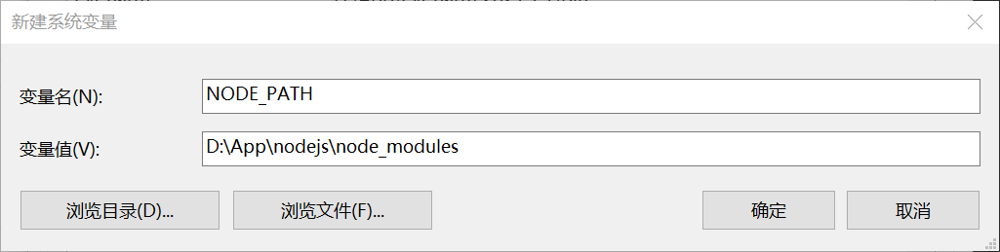
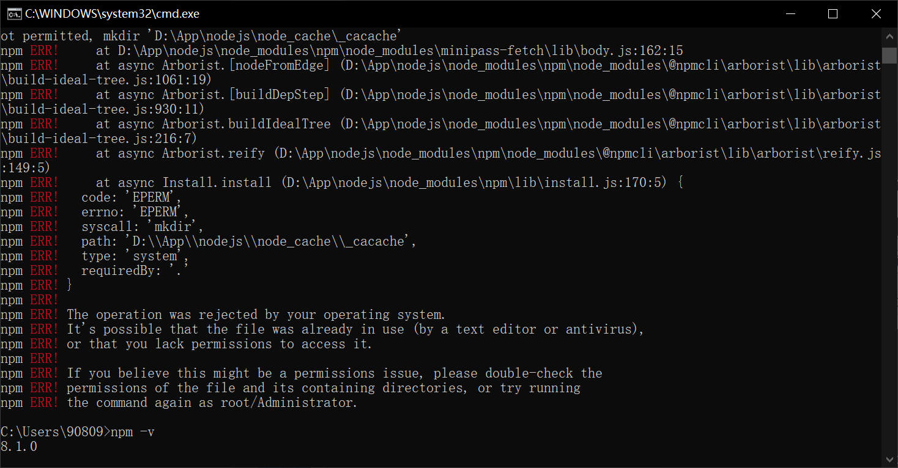
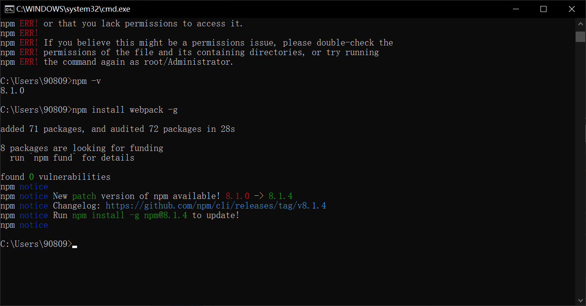

# Node.js 安装配置

## 下载安装

官网下载 ： https://nodejs.org/en/

一路默认，配置环境变量（添加Path）后，cmd查看版本号检验安装是否成功

```shell
node -v
npm -v
```


## 配置npm在安装全局模块时的路径和缓存cache的路径

```shell
npm config set prefix "D:\App\nodejs\node_global"
npm config set cache "D:\App\nodejs\node_cache"
```

再次配置环境变量

```ini
新建变量
NODE_PATH
D:\App\nodejs\node_modules

用户变量里的Path，将相应npm的路径改为：D:\App\nodejs\node_global
```




## 测试

cmd命令下执行 npm install webpack -g

如果npm install webpack -g跑起来出现ERR错误的话



可以尝试删除C:\Users{账户}\下的.npmrc文件 注意：这个文件是隐藏的

重新安装，ok



