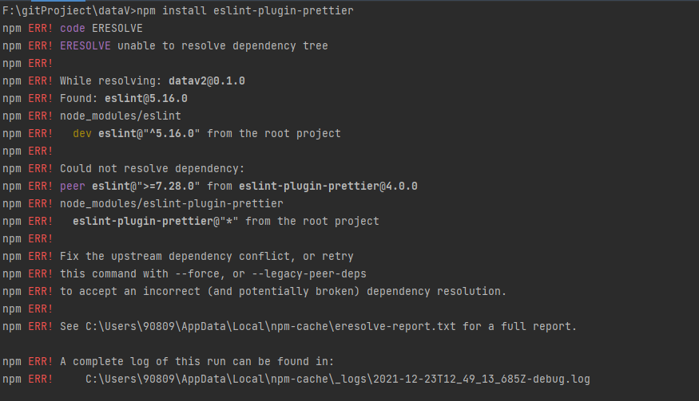

运行一个git上扒下来的vue+echart的工程

运行 npm install的时候报错

```shell
Error: EPERM: operation not permitted, open 'D:\App\nodejs\node_cache\_cacache\tmp\bf541cd1'
```

问题原因： 缓存问题导致

解决方法：删除c:\user\username\ .npmrc后重新运行项目

详见https://blog.csdn.net/qq_43429800/article/details/113759264


运行 npm run serve

```shell
 Error: Cannot find module 'F:\gitProjiect\dataV\node_modules\ret\lib\index.js'. Please verify that the package.json has a valid "main" entry
```

问题原因：移植别人的工程时可能会出现module缺失

解决方法：删除node_modules和package-lock.json，然后重新npm install

若还有module找不到，就全局安装npm install XXXX



出现了一个新问题

问题原因：安装的包与已经存在的包有冲突

解决方法