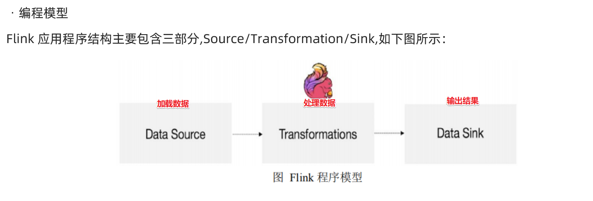

前面的工作回顾

将之前学的大数据内容依照笔记内容梳理了一遍，虚拟机和集群也重新搭了起来，之前跑过的flink程序也成功地运行了起来。学习了docker的安装配置，初步学习pyflink

问题1 前面学习的flink的编写都是使用的scala和java写的，我们的算法都是python，语言不统一的问题

首先设定大方向，使用scala或者java编写算法，或者，使用pyflink进行分布式

问题2  程序编写测试方式

最后的效果应该是代码测试完打包到集群的主机上运行，测试的话可以考虑使用本地单机模式测试。

问题3 分布式的部分

之前有考虑是否模型和优化过程都能进行分布式化处理

模型可以进行分布式化，但是优化算法不确定

问题4 学习途径

网上能参考的资料极少，pyflink没有系统教程，相关的内容都很少。

我们找到了少量flink、spark相关的分布式化的工程，但是调试过程中出现的问题难以解决，理论层面的东西在实践上有点走不动

目前的推进步骤

1. 学习Pyflink，从基础开始，先能够在windows上使用python编写flink程序
2. 调试现有的项目，使其能够成功运行，能带来极大参考价值
3. 参照现有项目，对论文的异常检测模型进行分布式化
4. 最后再考虑优化算法上的分布式化