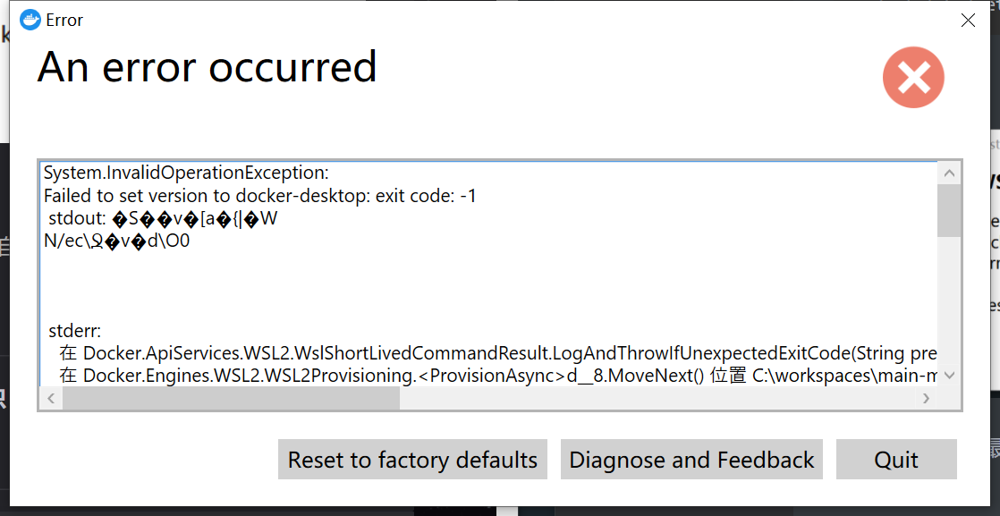

windows版本

### 1.官网下载安装


### 2.安装后可能会出现的问题


```shell
bcdedit /set hypervisorlaunchtype auto
```

重启之后解决


去微软官网下载最新版的wsl2安装[更新包下载链接](https://wslstorestorage.blob.core.windows.net/wslblob/wsl_update_x64.msi)



cmd/shell下执行

```shell
netsh winsock reset
```


重启电脑后打开docker成功


### 3.换源


```dockerfile
{
  "registry-mirrors": [
    "http://hub-mirror.c.163.com",
    "https://docker.mirrors.ustc.edu.cn"
  ],
  "insecure-registries": [],
  "debug": true,
  "experimental": false
}

```

### 4.测试环境

```shell
docker run hello-world
```


这行命令会让docker从官方仓库中拉去hello-world的镜像到本地,并且自动将其实例化成容器。如果出现报错，则环境配置可能出了问题