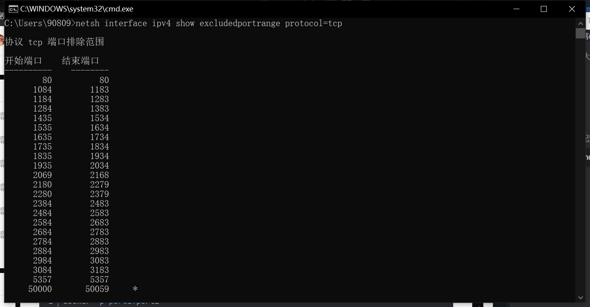
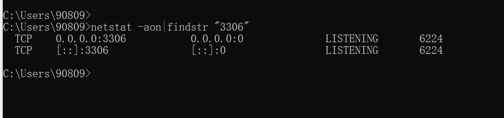
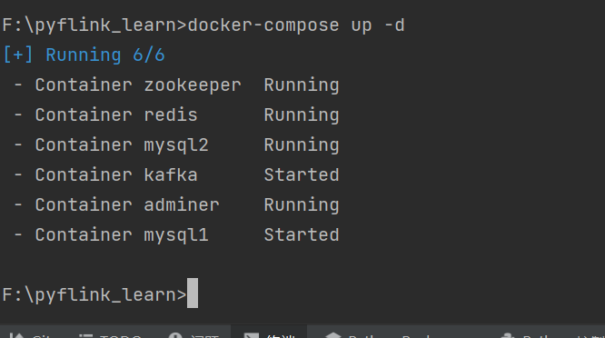
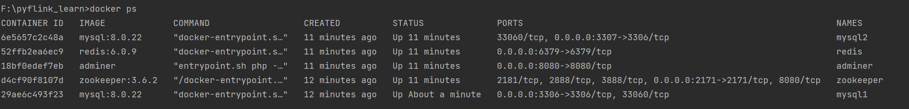
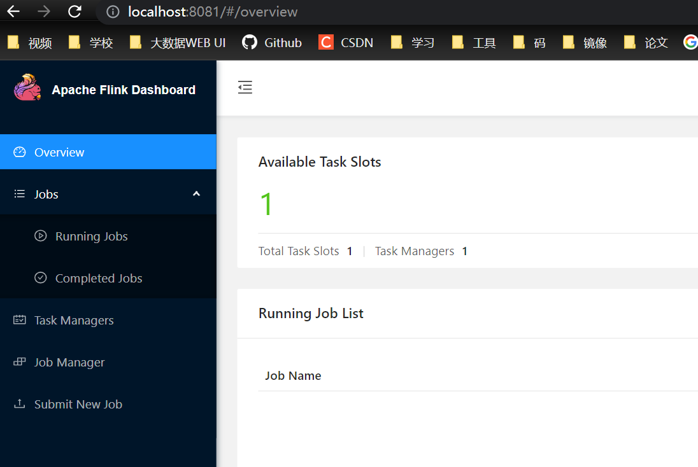

结合github项目https://github.com/uncleguanghui/pyflink_learn.git

## 0 准备环境

python 3.7、java1.8、flink1.11.2

安装docker

在项目根目录下，启动docker编排服务

```shell
# windows 系统先加下面这句
set COMPOSE_CONVERT_WINDOWS_PATHS=1
docker-compose up -d
```

搭建之后报错

```ini
 Error response from daemon: Ports are not available: exposing port TCP 0.0.0.0:2181 -> 0.0.0.0:0: listen tcp 0.0.0.0:2181: bind: An attempt was made to access a socket in a way forbidden by its access permissions.
```

通过cmd命令查看哪些端口被禁用TCP协议

```shell
netsh interface ipv4 show excludedportrange protocol=tcp
```



发现2181被禁止，将其改为2171

继续报错

```ini
Error response from daemon: Ports are not available: exposing port TCP 0.0.0.0:3306 -> 0.0.0.0:0: listen tcp 0.0.0.0:3306: bind: Only one usage of each socket address (protocol/network address/port) is normally permitted.

```

并没有被禁止，查看端口是否被占用

```shell
netstat -aon|findstr "3306"
```



杀死后成功启动（原因是和原本的mysqld程序冲突了）



有五个容器

1. MySQL 的账号密码都是 root。
2. Redis 的密码是 redis_password。

另外，停止命令如下：

```shell
# 停止
docker-compose stop

# 停止并删除
docker-compose down
```

如果遇到某个容器启动失败的话，一个简单的方法就是先删掉该容器，然后重新构建，以 kafka 为例：

```shell
docker rm kafka
docker-compose up -d --build
```

Windows还未安装flink ，官网下载解压后新建两个bat脚本

flink.bat

```shell
::###############################################################################
::  Licensed to the Apache Software Foundation (ASF) under one
::  or more contributor license agreements.  See the NOTICE file
::  distributed with this work for additional information
::  regarding copyright ownership.  The ASF licenses this file
::  to you under the Apache License, Version 2.0 (the
::  "License"); you may not use this file except in compliance
::  with the License.  You may obtain a copy of the License at
::
::      http://www.apache.org/licenses/LICENSE-2.0
::
::  Unless required by applicable law or agreed to in writing, software
::  distributed under the License is distributed on an "AS IS" BASIS,
::  WITHOUT WARRANTIES OR CONDITIONS OF ANY KIND, either express or implied.
::  See the License for the specific language governing permissions and
:: limitations under the License.
::###############################################################################
 
@echo off
setlocal
 
SET bin=%~dp0
SET FLINK_HOME=%bin%..
SET FLINK_LIB_DIR=%FLINK_HOME%\lib
SET FLINK_PLUGINS_DIR=%FLINK_HOME%\plugins
 
SET JVM_ARGS=-Xmx512m
 
SET FLINK_JM_CLASSPATH=%FLINK_LIB_DIR%\*
 
java %JVM_ARGS% -cp "%FLINK_JM_CLASSPATH%"; org.apache.flink.client.cli.CliFrontend %*
 
endlocal
 
```

start-cluster

```shell
::###############################################################################
::  Licensed to the Apache Software Foundation (ASF) under one
::  or more contributor license agreements.  See the NOTICE file
::  distributed with this work for additional information
::  regarding copyright ownership.  The ASF licenses this file
::  to you under the Apache License, Version 2.0 (the
::  "License"); you may not use this file except in compliance
::  with the License.  You may obtain a copy of the License at
::
::      http://www.apache.org/licenses/LICENSE-2.0
::
::  Unless required by applicable law or agreed to in writing, software
::  distributed under the License is distributed on an "AS IS" BASIS,
::  WITHOUT WARRANTIES OR CONDITIONS OF ANY KIND, either express or implied.
::  See the License for the specific language governing permissions and
:: limitations under the License.
::###############################################################################
 
@echo off
setlocal EnableDelayedExpansion
 
SET bin=%~dp0
SET FLINK_HOME=%bin%..
SET FLINK_LIB_DIR=%FLINK_HOME%\lib
SET FLINK_PLUGINS_DIR=%FLINK_HOME%\plugins
SET FLINK_CONF_DIR=%FLINK_HOME%\conf
SET FLINK_LOG_DIR=%FLINK_HOME%\log
 
SET JVM_ARGS=-Xms1024m -Xmx1024m
 
SET FLINK_CLASSPATH=%FLINK_LIB_DIR%\*
 
SET logname_jm=flink-%username%-jobmanager.log
SET logname_tm=flink-%username%-taskmanager.log
SET log_jm=%FLINK_LOG_DIR%\%logname_jm%
SET log_tm=%FLINK_LOG_DIR%\%logname_tm%
SET outname_jm=flink-%username%-jobmanager.out
SET outname_tm=flink-%username%-taskmanager.out
SET out_jm=%FLINK_LOG_DIR%\%outname_jm%
SET out_tm=%FLINK_LOG_DIR%\%outname_tm%
 
SET log_setting_jm=-Dlog.file="%log_jm%" -Dlogback.configurationFile=file:"%FLINK_CONF_DIR%/logback.xml" -Dlog4j.configuration=file:"%FLINK_CONF_DIR%/log4j.properties"
SET log_setting_tm=-Dlog.file="%log_tm%" -Dlogback.configurationFile=file:"%FLINK_CONF_DIR%/logback.xml" -Dlog4j.configuration=file:"%FLINK_CONF_DIR%/log4j.properties"
 
:: Log rotation (quick and dirty)
CD "%FLINK_LOG_DIR%"
for /l %%x in (5, -1, 1) do ( 
SET /A y = %%x+1 
RENAME "%logname_jm%.%%x" "%logname_jm%.!y!" 2> nul
RENAME "%logname_tm%.%%x" "%logname_tm%.!y!" 2> nul
RENAME "%outname_jm%.%%x" "%outname_jm%.!y!"  2> nul
RENAME "%outname_tm%.%%x" "%outname_tm%.!y!"  2> nul
)
RENAME "%logname_jm%" "%logname_jm%.0"  2> nul
RENAME "%logname_tm%" "%logname_tm%.0"  2> nul
RENAME "%outname_jm%" "%outname_jm%.0"  2> nul
RENAME "%outname_tm%" "%outname_tm%.0"  2> nul
DEL "%logname_jm%.6"  2> nul
DEL "%logname_tm%.6"  2> nul
DEL "%outname_jm%.6"  2> nul
DEL "%outname_tm%.6"  2> nul
for %%X in (java.exe) do (set FOUND=%%~$PATH:X)
if not defined FOUND (
    echo java.exe was not found in PATH variable
    goto :eof
)
echo Starting a local cluster with one JobManager process and one TaskManager process.
echo You can terminate the processes via CTRL-C in the spawned shell windows.
echo Web interface by default on http://localhost:8081/.
start java %JVM_ARGS% %log_setting_jm% -cp "%FLINK_CLASSPATH%"; org.apache.flink.runtime.entrypoint.StandaloneSessionClusterEntrypoint --configDir "%FLINK_CONF_DIR%" > "%out_jm%" 2>&1
start java %JVM_ARGS% %log_setting_tm% -cp "%FLINK_CLASSPATH%"; org.apache.flink.runtime.taskexecutor.TaskManagerRunner --configDir "%FLINK_CONF_DIR%" > "%out_tm%" 2>&1
endlocal
```

taskmanager配置,在flink/conf/flink-conf.yaml中添加

```yaml
taskmanager.cpu.cores: 2
taskmanager.memory.task.heap.size: 512m
taskmanager.memory.managed.size: 512m
taskmanager.memory.network.min: 64m
taskmanager.memory.network.max: 64m

```

log4j2 的错误先不用管，可以在网页UI看到flink的状态 localhost:80081



运行第一个程序遇到的问题

Exception in thread "main" java.lang.RuntimeException: The configuration directory was not specified. Please specify the directory containing the configuration file through the 'FLINK_CONF_DIR' environment
variable.

没有flink_conf_dir, 到flink-conf.yaml里加

 [main] ERROR org.apache.flink.client.cli.CliFrontend - Invalid command line arguments.
org.apache.flink.client.cli.CliArgsException: Python command line option detected but the flink-python module seems to be missing or not working as expected.